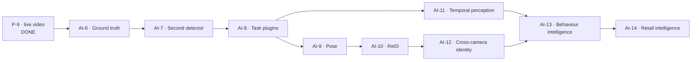

# AI Roadmap

**Status: DESIGN ONLY.** This is a sequencing document. It commits to no dates and authorises no
implementation. AI Runtime v1.0 is frozen (2026-08-01) and P-9 introduced no model, no engine and no
new perception task.

---

## 1. Where the platform actually is

Being precise about this is the point of the section — a roadmap drawn from an inflated starting
position produces a plan that skips the work that was never done.

| | Delivered and proved | Evidence |
| --- | --- | --- |
| Person detection, per frame | ✅ | `yolox-nano` v1.0.0, `CPUExecutionProvider`; measured on the fixture corpus and, in P-9, live through a browser |
| Multi-object tracking with identity across gaps | ✅ | `predictive-iou`, ADR-0041 identity, `reentry.py`; live re-entry linking observed in P-9 |
| Zones, dwell, loitering | ✅ | `zones.py`, rule engine, incidents |
| One perception path for every frame source | ✅ | P-9 — [LIVE_WEBCAM_VALIDATION.md](../validation/LIVE_WEBCAM_VALIDATION.md) |
| Engine plugin seam | ✅ code, ⚠️ only ONNX exercised | `engines.py` lists six engines; one has ever run |
| Model registry, versions, rollout | ✅ code, ⚠️ one model registered | `model_registry.py`, `model_lifecycle.py` |
| Behaviour analyzer plugin seam | ✅ code, ⚠️ thinly exercised | `behavior_registry.py`, `composite.py` |
| Accuracy evaluation harness | ✅ code, ⛔ **no real CCTV corpus** | `evaluation.py`, `dataset.py` — the harness exists; the footage does not |
| Multi-task perception (pose, seg, ReID, OCR, action, VLM) | ⛔ none | `RawDetection` has four slots |
| GPU execution | ⛔ never run | no CUDA/TensorRT deployment exists |
| Real CCTV optics | ⛔ never seen | every clip is authored or webcam-sourced |

⭐ **The seams are further ahead than the content.** Three plugin registries exist and each has
exactly one member. The risk this creates is specific: a seam with one implementation has never been
proved to be a seam. The roadmap therefore front-loads *second implementations* over new capability.

---

## 2. Sequence

### AI-6 — Ground truth before anything else

⛔ **Nothing downstream is decidable without this.** Every later stage asks "is the new thing
better?", and there is currently no dataset that can answer it for real surveillance footage. The
harness is built (`evaluation.py`, `dataset.py`); the corpus is empty.

- Acquire and licence the corpus in [CCTV_BENCHMARK_DATASET.md](CCTV_BENCHMARK_DATASET.md).
- Annotate: boxes, identities across occlusion, per-scenario expectations, **negative controls**.
- Freeze it. Publish the baseline for the *current* model, warts included.

**Exit:** `evaluate_cli` produces precision/recall/ID-switch numbers for `yolox-nano` on real
footage, and those numbers are in the repository as the line every future model is measured against.

### AI-7 — A second detector, changing nothing else

The cheapest possible proof that the engine and registry seams are real.

- Register one more detector (a larger YOLO family member is the obvious candidate).
- Run both through [BENCHMARK_FRAMEWORK.md](BENCHMARK_FRAMEWORK.md) and AI-6's corpus.
- Adopt or reject on evidence, and **write down the rejection** if it is rejected.

**Exit:** two models registered, both benchmarked on one dataset, an adoption decision with numbers.
⚠️ If this requires a code change outside the registry, the seam was not a seam and that is the
finding.

### AI-8 — The task plugin seam

Implement `PerceptionOutput` and the task registry
([MODEL_PLUGIN_ARCHITECTURE.md](MODEL_PLUGIN_ARCHITECTURE.md)). No new capability ships — detection
is migrated onto the new shape and must produce byte-identical results.

**Exit:** the fixture corpus produces identical `DetectionResult` documents before and after. ⭐ Byte
comparison, both directions, per the replay discipline — a refactor of the perception path that is
"probably equivalent" is not equivalent.

### AI-9 — Pose

First genuinely new task. Unlocks posture, fall detection and reach/shelf-interaction primitives.
Two-stage profile (detect → pose), per-stage budgets, `onError: degrade` explicit.

### AI-10 — Re-identification

Embeddings on `Detection.embedding` (the field exists). ⛔ **Recorded alongside the geometric linker,
never replacing it** — see MODEL_PLUGIN_ARCHITECTURE §5.

### AI-11 — Temporal perception

The hard one. A per-span perception stage: bounded per-camera frame buffer, a result whose `frameSeq`
is a range, sliding-window dedup semantics, clip-based evidence. Stated as a problem in
PERCEPTION_ENGINE_ARCHITECTURE §4 so it is not discovered mid-implementation.

### AI-12 — Cross-camera identity

Needs AI-10 plus a topology (which cameras are adjacent, with what transit time). Camera Foundation
already carries the estate hierarchy; the adjacency graph does not exist.

### AI-13 / AI-14 — Behaviour and retail intelligence

Covered in [BEHAVIOUR_AI_ROADMAP.md](BEHAVIOUR_AI_ROADMAP.md). ⭐ Both land on registries that
already exist, which is why they are last rather than hardest.

---

## 3. Parallel tracks

| Track | Runs alongside | Note |
| --- | --- | --- |
| **GPU / TensorRT** | AI-7 onward | ⚠️ A GPU changes throughput *and* numeric output; every accuracy number must be re-measured, not carried over. |
| **Hardware certification** | any | Requires physical IP cameras, an NVR and a customer-representative box. No amount of software validation substitutes. |
| **Model provenance / supply chain** | AI-6 onward | `ai/mlops` exists. Weights are a supply-chain surface; a model file is executable input. |
| **Edge deployment** | after AI-8 | Per-stage budgets are what make an edge box sizeable. |

---

## 4. Rules that hold across every stage

1. **One perception path.** P-9's result. Any proposal that adds a second inference path for a
   special case is rejected by default.
2. **No model is adopted without a benchmark and an evaluation** — both directions scored, negative
   controls included.
3. **Frozen contracts stay additive.** Results are archived and cited.
4. **Absent is `null` with a reason.** ADR-0039, at every new stage.
5. **Perception observes; rules decide.** No business logic migrates into a plugin.
6. **Simulation never certifies.** A synthetic clip is a regression test, not evidence about a
   customer's camera.

---

## 5. What this roadmap deliberately does not promise

- No dates.
- No claim that any of AI-9 → AI-14 is achievable at current CPU budgets. Pose at 4 fps on 8 cameras
  on a `CPUExecutionProvider` is an open question, and the honest answer is that it has not been
  measured.
- No claim of accuracy on real CCTV. Until AI-6, VIP has **no measured accuracy on real surveillance
  footage** — only on authored clips whose ground truth it also wrote.
