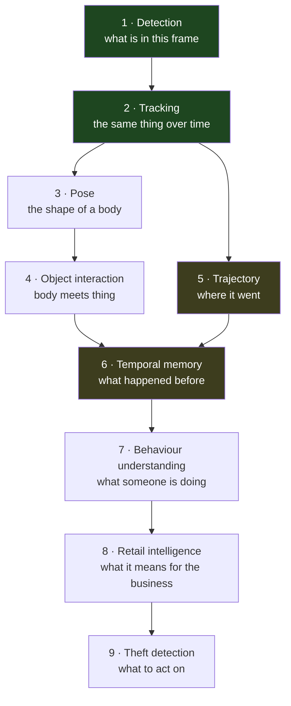

# Behaviour AI Roadmap

**Status: DESIGN ONLY.** No behaviour model is implemented or authorised by this document. P-9
introduced none. The point of writing it now is to show that every capability below lands on
registries that **already exist**, so none of them needs a separate AI pipeline.

---

## 1. The ladder



**Green — delivered.** Detection and tracking, including identity across occlusion and re-entry
(ADR-0041), proved live in P-9.
**Amber — partly present.** `track_motion.py` computes path length, displacement, speed, dwell,
heading and straightness. `temporal_window.py` and `BehaviorLifecycleStore` hold behaviour state over
time. Both work on **tracks**, not pixels.
**Uncoloured — not started.**

⭐ **Rungs 5 and 6 are further along than the ladder suggests**, because trajectory and track-derived
temporal memory were built for loitering. What is missing at rung 6 is *pixel*-level temporal
perception — see [PERCEPTION_ENGINE_ARCHITECTURE.md](PERCEPTION_ENGINE_ARCHITECTURE.md) §4.

---

## 2. Each rung, and what it actually needs

| Rung | Needs | New pipeline? |
| --- | --- | --- |
| 1 Detection | — | ✅ done |
| 2 Tracking | — | ✅ done |
| 3 Pose | a `keypoints` task plugin (AI-9) | ⛔ no — a second stage in one profile |
| 4 Object interaction | pose + a second detection class (bag, shelf, till) + a proximity analyzer | ⛔ no — analyzer in `behavior_registry` |
| 5 Trajectory | mostly present (`track_motion.py`); needs zone-graph transitions | ⛔ no |
| 6 Temporal memory | present for tracks; **absent for pixels** (AI-11) | ⚠️ a new *stage kind*, still one pipeline |
| 7 Behaviour understanding | composition of 3–6 | ⛔ no — `composite.py` exists for exactly this |
| 8 Retail intelligence | zone roles + external correlation (POS) | ⛔ no — rules + workflow |
| 9 Theft detection | 7 + 8 + evidence + operator workflow | ⛔ no |

⭐ **Seven of the nine rungs need no new AI pipeline at all.** That is the return on the plugin
architecture, and it is the single claim this document exists to make.

---

## 3. How each named capability reuses the platform

| Capability | Perception it needs | Where the logic lives | Contract |
| --- | --- | --- | --- |
| **Loitering** | detection + tracking | ✅ shipped — rule engine, zones, dwell | none new |
| **Queue analytics** | detection + tracking + zone | behaviour analyzer (occupancy over time in a zone with role `queue`) | none new |
| **Shelf interaction** | detection + **pose** (reach) + shelf zone | analyzer: wrist keypoint enters a zone of role `shelf` | keypoints on `Detection.attributes` |
| **Checkout correlation** | detection + tracking at a `till` zone | rules service joined to an external POS event | ⚠️ a **connector**, not perception — `connector-platform` |
| **Tailgating** | detection + tracking at a `door` zone | analyzer: two identities cross one threshold within N seconds | none new |
| **Left object** | detection of an object class + tracking + **temporal memory** | analyzer: static object, no owner nearby for N seconds | needs a non-person class |
| **PPE compliance** | detection (helmet/vest classes) **or** pose + attribute classifier | analyzer: required item absent on a tracked person | new classes, no new pipeline |
| **Fall detection** | **pose** (aspect ratio, keypoint collapse) + temporal | analyzer over a short window | keypoints |
| **Violence** | ⛔ **per-span action recognition** (AI-11) | analyzer over span results | ⛔ needs the span result contract |
| **Retail theft** | composition of shelf interaction + concealment + checkout bypass | ✅ `composite.py` — `RuleCompositeAnalyzer`, declarative | none new |

⚠️ **Only two rows need anything genuinely new**: a non-person detection class (Left object, PPE) and
per-span perception (Violence). Everything else is a registration plus configuration.

⛔ **Checkout correlation is not perception and must not be built as if it were.** `composite.py`
already draws this line: *"Composite is still PERCEPTION — it answers 'what was observed?', never
'what should happen?' (no schedules / permissions / business hours / POS)."* A till transaction is
business state; joining it to an observation is the rules service's job. Putting POS in the runtime
would make the perception layer depend on a customer's ERP.

---

## 4. Theft detection, specifically

The end goal, and the one most likely to be built as a monolith. Decomposed:

```
   observation                          composite                    decision
┌────────────────────┐          ┌──────────────────────┐        ┌───────────────┐
│ person tracked     │          │ "concealment         │        │ rule:         │
│ pose: reach→shelf  │─────────▶│  candidate"          │───────▶│ + exited via  │
│ object count Δ     │          │  co-occurring        │        │   door zone   │
│ dwell in aisle     │          │  behaviours on ONE   │        │ + no till     │
│ shelf zone         │          │  identity, one zone  │        │   event       │
└────────────────────┘          └──────────────────────┘        └───────────────┘
        perception plugins            behaviour + composite            rules + POS connector
```

⚠️ **Three properties this decomposition buys, which a monolithic "theft model" cannot:**

1. **Attribution.** When it is wrong, the tier that was wrong is identifiable. A single model that
   outputs `theft: 0.82` cannot be debugged, tuned per site, or defended.
2. **Evidence.** An incident cites the contributing behaviours by id (`relatedBehaviorIds`), which is
   what makes it reviewable by a human and citable to a loss-prevention team.
3. **Configurability.** A pharmacy and a supermarket disagree about what is suspicious. Composition
   is configuration; a trained end-to-end model is a retraining job per customer.

⛔ **And one obligation.** Theft detection accuses people. Its false-positive rate is not a
performance metric — it is the rate at which the product causes an innocent person to be stopped.
Any theft capability requires: a human in the loop by default, a per-tenant confidence floor, an
audit trail of what evidence produced the call, and a measured false-positive rate on a corpus
containing many hours of ordinary shopping. That corpus does not exist
([CCTV_BENCHMARK_DATASET.md](CCTV_BENCHMARK_DATASET.md)).

---

## 5. Sequencing

| Wave | Capabilities | Blocked on |
| --- | --- | --- |
| **A** | Queue analytics, tailgating | nothing — detection + tracking + zones today |
| **B** | Shelf interaction, fall detection | pose (AI-9) |
| **C** | Left object, PPE | non-person detection classes |
| **D** | Cross-camera behaviour | ReID (AI-10) + camera adjacency graph |
| **E** | Violence, complex actions | per-span perception (AI-11) |
| **F** | Retail theft | B + C + D + a real corpus + operator workflow |

⭐ **Wave A needs no AI work at all** — two analyzer registrations against capabilities already
shipped. It is where the next customer-visible value is cheapest, and a roadmap that starts at pose
would miss it.

---

## 6. Rules that hold across all of it

1. **One perception pipeline.** No behaviour capability introduces a second inference path.
2. **Analyzers never call analyzers.** Composition is the composite tier's job.
3. **Perception observes; rules decide.** No business hours, permissions or POS in the runtime.
4. **Absent is `null` with a reason.** A behaviour that could not be evaluated is not a behaviour
   that did not occur.
5. **Every behaviour is evaluated for false positives before it is enabled** — an alert nobody trusts
   is worse than no alert.
6. **Human in the loop for any accusatory output.**

---

## 7. Related

- [PERCEPTION_ENGINE_ARCHITECTURE.md](PERCEPTION_ENGINE_ARCHITECTURE.md) — §4, the temporal problem
- [MODEL_PLUGIN_ARCHITECTURE.md](MODEL_PLUGIN_ARCHITECTURE.md)
- [AI_ROADMAP.md](AI_ROADMAP.md) — AI-13/AI-14
- [CCTV_BENCHMARK_DATASET.md](CCTV_BENCHMARK_DATASET.md)
