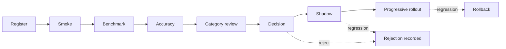

# Model Evaluation Plan

**Status: DESIGN ONLY.** This is the process a model must pass before it may run against a customer's
cameras. No model has yet been through it, including the one in production — `yolox-nano` predates
this plan, and §7 says what that means.

---

## 1. The rule

> ⛔ **No perception model is adopted, replaced, or upgraded without a complete evaluation against
> the frozen CCTV benchmark dataset, scored in both directions, with the result recorded in the
> repository — including when the result is a rejection.**

"Both directions" is the load-bearing part. `evaluation.py` already states why:

> *In surveillance analytics, false positives are the failure mode that loses a deployment: an
> operator who is paged four times a night for nothing stops reading the alerts by Thursday, and the
> system is then worse than useless because it also stopped them watching.*

---

## 2. Stages



### 2.1 Register
Model + version in `model_registry.py`, with licence, provenance, training-data description and
checksum. ⚠️ **A model file is executable input.** Provenance is a supply-chain control, not
paperwork.

### 2.2 Smoke
Loads, warms up, produces a plausible result on one known frame. Fails fast on a wrong input shape,
a missing provider, or a label space that does not contain `person`.

### 2.3 Benchmark — operational
[BENCHMARK_FRAMEWORK.md](BENCHMARK_FRAMEWORK.md). Refused if the operating point is not recorded
(threads, provider, preprocessing version).

### 2.4 Accuracy
The frozen corpus, `evaluation.py`. Produces precision, recall, F1, identity switches, per-category
breakdown, and **false positives on negative controls**.

### 2.5 Category review — ⭐ where an aggregate is not enough
The aggregate is reported but is **not** the decision input. A model must be reviewed per category:

```
low-light · backlight · crowd · occlusion · top-down · portrait · far-field · motion-blur
```

⚠️ A model that gains 3 % overall while losing 20 % in low light is a **worse** model for retail,
where a meaningful share of the operating day is under artificial light. Aggregates hide exactly the
regressions that cost a deployment.

### 2.6 Decision
A human writes an adopt/reject with a reason, and it is committed. ⛔ The framework never computes a
verdict.

**A rejection is recorded with the same weight as an adoption.** Without it, the same model is
re-proposed in a year and re-evaluated at full cost, and the reason it lost is lost.

### 2.7 Shadow
The candidate runs **alongside** production on live frames, results recorded, **no events published**
and **no incidents raised**.

⭐ This is the only stage that sees the customer's real cameras, and it is the only stage that can
find what the corpus could not: this shop's lighting, this camera's optics, this store's shelf
layout. ⚠️ It doubles inference cost for its duration, which must be sized for, not discovered.

⛔ **Shadow output must never reach the event bus.** A shadow model that published would raise
duplicate incidents, and an operator would act on an unadopted model's opinion.

### 2.8 Progressive rollout
Per tenant, then per site, then per camera group, with `model_lifecycle.py`. Rollback is a registry
operation, not a redeploy. ⚠️ Every incident carries the model id and version that produced it
(`DetectionResult` already stamps this), so a post-rollback audit can say which incidents came from
which model.

---

## 3. Acceptance thresholds

| Metric | Threshold | Why |
| --- | --- | --- |
| Recall vs incumbent, **per category** | no category may regress by > 2 % absolute | prevents an aggregate win masking a category loss |
| False positives on negative controls | must not increase | the deployment-losing failure |
| Identity switches (where ground truth exists) | must not increase | a track that changes id breaks dwell, loitering and every accumulation |
| p95 inference latency at target camera count | within the profile's budget | over budget = dropped frames = missing evidence |
| Peak RSS | within the deployment's sizing | an OOM in the runtime is an outage |
| Determinism | same input → same output on the same build | ⛔ a non-deterministic model cannot produce citable evidence |

⚠️ **These are gates, not a score.** Passing all six is necessary, not sufficient; §2.6 still applies.

---

## 4. What must be re-evaluated, and when

| Change | Re-evaluate |
| --- | --- |
| New model or version | full plan |
| Same model, different engine (ONNX → TensorRT) | ⛔ **full plan.** Different kernels, different rounding, genuinely different outputs |
| Same model, different provider (CPU → CUDA) | ⛔ **full plan.** Same reason |
| Preprocessing change | full plan — it is part of the model |
| Confidence threshold change | accuracy + category review (operational unchanged) |
| Tracker parameter change | accuracy (identity metrics), not detection metrics |
| Runtime version bump | smoke + benchmark; accuracy if any pipeline stage changed |

⭐ The three "same model" rows are the ones a team will want to skip, and they are the rows most
likely to change results. A TensorRT conversion is a new model.

---

## 5. Reporting

Every evaluation produces a committed report:

- dataset id and **frame-sequence hash**
- both arms' full operating points
- per-category tables
- negative-control results
- the decision, its author, and the reason
- ⚠️ what was **not** evaluated — always populated. GPU, real optics at the customer site, camera
  counts above the tested number, and any category the corpus does not yet cover.

---

## 6. What evaluation cannot establish

- Performance on a camera the corpus does not resemble.
- Behaviour under a failure mode not in the corpus (a lens with condensation, IR flare at night, a
  camera slowly rotating on a loose mount).
- Fairness across demographics. ⚠️ Stated explicitly because it is a real obligation for a
  surveillance product and this plan does not currently discharge it. A corpus that is not
  demographically characterised cannot support any claim about differential accuracy, and the absence
  of a claim is not the absence of a difference.

---

## 7. ⚠️ The incumbent has not passed this plan

`yolox-nano` v1.0.0 is in production and predates this document. Its measured accuracy comes from
**authored fixtures whose ground truth VIP also wrote** and, since P-9, from browser-captured
synthetic scenes. Neither is real surveillance footage.

The first execution of this plan (AI-6) must therefore evaluate the **incumbent** and publish that
baseline, honestly, before any candidate is compared to it. Comparing a candidate against a baseline
nobody has measured produces a Δ against an unknown.

---

## 8. Related

- [BENCHMARK_FRAMEWORK.md](BENCHMARK_FRAMEWORK.md)
- [CCTV_BENCHMARK_DATASET.md](CCTV_BENCHMARK_DATASET.md)
- [AI_ROADMAP.md](AI_ROADMAP.md) — AI-6 is this plan's first execution
