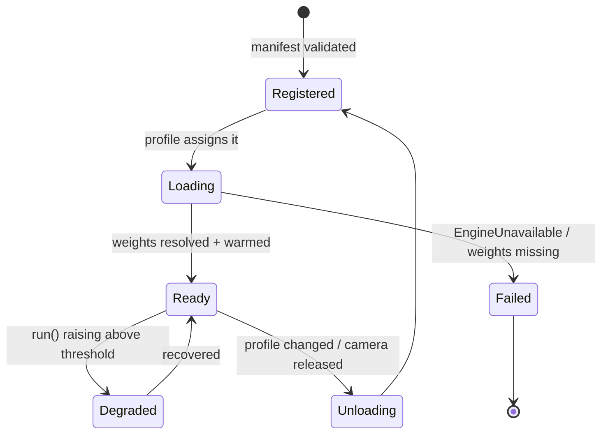

# Model Plugin Guide

**Status: the interface is IMPLEMENTED (P-10); no additional model ships with it.**

This is the guide for writing a perception plugin. The interface it describes is real as of
2026-08-08 — see [PERCEPTION_ENGINE](PERCEPTION_ENGINE.md) and
[ADR-0050](../adr/ADR-0050-the-perception-vocabulary-is-the-plugin-boundary.md).

## Writing one, in full

```python
from perception import PerceptionOutput, RawInstance, Keypoint, TASK_POSE
from perception_registry import PerceptionRegistry

class RtmPoseModule:
    task = TASK_POSE
    execution_provider = "CPUExecutionProvider"

    def load(self, ref: dict) -> None: ...          # resolve the artifact, build a session
    def preprocess(self, ctx) -> object: ...        # FrameContext → tensor
    def analyse(self, prepared) -> PerceptionOutput:
        return PerceptionOutput(
            task=TASK_POSE,
            instances=[RawInstance(score=0.86, bbox=(...), keypoints=[Keypoint(...)], skeleton="coco-17")],
        )
    def unload(self) -> None: ...

registry.register(TASK_POSE, "rtmpose-s", RtmPoseModule)
```

**Four rules a plugin must hold**, each of which the registry or the contract enforces:

| Rule | Enforced by |
| --- | --- |
| A task must be registered before it can be used | `describe_task()` raises `UnknownTask` |
| A module name must be unique per task | `register()` raises unless `replace=True` |
| Coordinates are normalized `[0,1]`, origin top-left | Convention — ⚠️ **not** machine-checked; a plugin emitting pixels renders in the wrong place and nothing fails |
| Construction is deferred to the factory | Heavy imports must not run at registration, or an unavailable dependency breaks startup instead of one module |

⭐ **Bringing a task nobody designed for** is `register_task("gaze", "Where a subject is looking")` —
no change to any module in the runtime.

The sections below are the original P-9 analysis of which seams already existed.

---

## 1. Two registries, and only one of them is new

The runtime already distinguishes **how a model runs** from **which model runs**:

```
engines.py        engine name  → ModelAdapter factory     (yolo | onnx | tensorrt | openvino | torchscript | python-custom)
model_registry.py (tenant, model id) → versions, active version, capabilities, enabled
selector.py       {task, family, version-range, accelerator} → a concrete model version
```

⭐ Adding **TensorRT** support, or **a customer's own Python model**, needs no new architecture
today: register a factory in `engines.py`. That seam is done.

What does not exist is a registry of **tasks**. `perception.person-detection` is a capability
manifest, and every capability manifest resolves to a model whose `infer()` returns boxes (see
[PERCEPTION_ENGINE.md](PERCEPTION_ENGINE.md) §1). A task registry is the
new thing.

---

## 2. The plugin contract

```python
# DESIGN ONLY.
class PerceptionPlugin(Protocol):
    """One perception task. Registered by id; never imported by another plugin."""

    task: str                    # 'detection' | 'pose' | 'segmentation' | 'reid' | 'ocr' | 'action' | 'vlm'
    output_kind: OutputKind      # the tagged-union arm it produces
    requires: tuple[str, ...]    # upstream stages it consumes, e.g. ('detection',) for pose

    def manifest(self) -> PluginManifest: ...
    def load(self, binding: ModelBinding, adapter: ModelAdapter) -> None: ...
    def run(self, ctx: FrameContext, upstream: PerceptionBundle) -> PerceptionOutput: ...
    def unload(self) -> None: ...
    def health(self) -> PluginHealth: ...
```

### The five rules

**1. ⛔ A plugin never calls another plugin.**
It declares `requires` and receives the upstream results in `upstream`. This is the rule
`behavior_registry.py` already enforces (*"Analyzers never call one another"*), for the same reason:
the moment one plugin can invoke another, the execution order becomes an emergent property of the
call graph rather than a declared property of the profile, and it cannot be benchmarked, cached, or
reasoned about when one of them is slow.

**2. ⛔ A plugin persists nothing and reads no tenant state.**
`Capability` already holds this (*"The capability persists NO tenant data"*). A plugin that cached
per-tenant state would make the runtime stateful, which breaks horizontal scaling and turns a
restart into a data-loss event.

**3. ⚠️ A plugin declares its failure, it does not fake success.**
`run()` may return an output with `kind` set and an empty arm **only** when the model genuinely found
nothing. If the model could not run — weights missing, input shape wrong, provider unavailable — it
raises. ADR-0039: a pose stage that could not execute must not be indistinguishable from a frame with
no people in it.

**4. ⚠️ A plugin is version-stamped or it is not usable as evidence.**
Every `PerceptionOutput` carries the plugin id, plugin version, model id, model version and execution
provider. `DetectionResult` already does this and the reason is in its docstring: *"Carries
everything needed to REPRODUCE the inference later."* A result that cannot name what produced it
cannot be cited.

**5. ⚠️ A plugin's cost is measured, per stage, always on.**
`Metrics` already records per-capability timings. A multi-stage profile must record per-**stage**
timings, or "the profile got slower" is unattributable — and with 2–4 stages that will be the most
common performance question.

---

## 3. Declaring a perception graph

A profile becomes a small declarative graph. `profiles.py` is already the unit an operator assigns to
a camera, so this extends a concept the control plane and console already have.

```yaml
# DESIGN ONLY
id: retail-person-pose
stages:
  - id: person
    task: detection
    model: { family: yolox, version: ">=1" }
    filter: { label: person, minConfidence: 0.35 }
  - id: pose
    task: pose
    model: { family: rtmpose, version: ">=1" }
    input: person            # by stage id, not by heuristic
    onError: degrade         # 'degrade' | 'fail'
budget:
  perFrameMs: 250            # enforced by BENCHMARK_FRAMEWORK
```

⚠️ **`onError: degrade` is per stage and defaults to `fail`.** A pose stage that quietly degrades to
"no keypoints" turns a fall-detection rule into a rule that never fires, and nothing in the system
looks broken. Degradation must be chosen, recorded on the result, and visible on the camera's
processing page — the same treatment `FrameDelivery.reason` already gets.

---

## 4. Lifecycle



⚠️ **`Ready` requires a warm-up inference, not a successful load.** ONNX Runtime allocates arenas and
picks kernels on the first call; without a warm-up the first real frame of every deployment pays
several hundred milliseconds and lands in the p95 of whatever was being measured at the time. The
existing `CapabilityState` machine (#5, *"a lifecycle state, not a boolean"*) is the right place.

---

## 5. Compatibility with the frozen contracts

| Contract | Effect | Mechanism |
| --- | --- | --- |
| `DetectionResult` v1.1 | unchanged for detection-only profiles | new arms are additive keys a v1.1 reader ignores |
| `Detection.embedding` | reused by ReID | already present |
| `Detection.attributes` | carries keypoints/masks by reference | already present, open by design |
| `EventEnvelope` | unchanged | new event *types* are registrations, not schema changes |
| `Track` / ADR-0041 identity | unchanged | ReID **augments** re-entry linking; it does not replace `reentry.py` |

⛔ **ReID must not silently become the identity authority.** `reentry.py` links identities on
geometry and time, and its answers are already in customers' incidents. An embedding-based link is a
*different* answer with different failure modes (it links twins; it survives a costume change). When
ReID lands, both must be recorded — `identityId` from the existing linker, and the embedding match as
an attribute with its distance — until there is evidence about which is right for CCTV. Replacing one
with the other in a single release would change every historical comparison with no way to tell.

---

## 6. What a plugin author must supply

1. A manifest: id, version, task, output kind, `requires`, supported engines, input size, licence.
2. A model reference resolvable by `selector.py` (family + version range), never a hardcoded path.
3. A **benchmark entry** — throughput and latency on CPU at 1/4/8 cameras
   ([BENCHMARK_FRAMEWORK.md](BENCHMARK_FRAMEWORK.md)).
4. An **evaluation entry** — precision and recall against the CCTV corpus
   ([MODEL_EVALUATION_PLAN.md](MODEL_EVALUATION_PLAN.md)).
5. A **negative control** — a case the plugin must report *nothing* for. `evaluation.py` already
   scores absence as directly as presence, because *"an operator who is paged four times a night for
   nothing stops reading the alerts by Thursday."*

⛔ Items 3–5 are not documentation. A plugin without them cannot be adopted, because there would be
no way to say whether the next one is better.

---

## 7. Related

- [PERCEPTION_ENGINE.md](PERCEPTION_ENGINE.md)
- [BENCHMARK_FRAMEWORK.md](BENCHMARK_FRAMEWORK.md)
- [MODEL_EVALUATION_PLAN.md](MODEL_EVALUATION_PLAN.md)
- [DATASET_STRATEGY.md](DATASET_STRATEGY.md)
