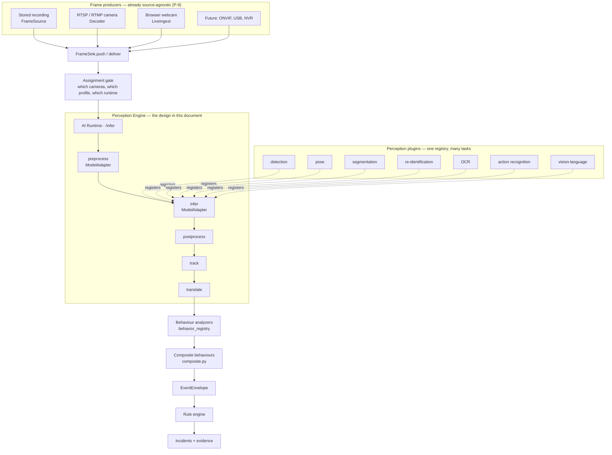

# Perception Engine Architecture

**Status: DESIGN ONLY.** Nothing in this document is implemented, and P-9 implements none of it. It
describes the shape VIP's perception layer must take to support multiple model families, and — more
usefully — it identifies exactly which parts of that shape **already exist** and which single seam
does not.

> **AI Runtime v1.0 is frozen (2026-08-01).** This design is what a future AI-6 would build against,
> written now so the live-video milestone does not accrete decisions that make it harder.

---

## 1. The finding this document exists to record

VIP is already a plugin architecture in three of the four places it needs to be. A reader coming to
this cold will assume the work is "make the AI pluggable", and would then rebuild seams that are
present and working. The actual gap is one data structure.

| Seam | Status | Where |
| --- | --- | --- |
| **Model backend** (ONNX / TensorRT / OpenVINO / TorchScript / custom) | ✅ exists | `ai/inference/engines.py` — a name → adapter-factory registry; heavy runtimes imported lazily inside the factory. "YOLO is NOT special-cased." |
| **Model binding** (what a capability asks for vs what it gets) | ✅ exists | `ai/inference/selector.py` (ADR-0002). A capability declares `{task, family, version-range, accelerator}`; swapping the model is a registry change, never a code change. |
| **Model lifecycle** (versions, active version, rollout, rollback, tenant scoping) | ✅ exists | `ai/inference/model_registry.py`, `model_lifecycle.py` |
| **Behaviour analyzers** (loitering, tailgating, abandoned object, …) | ✅ exists | `ai/inference/behavior_registry.py` — "analyzers are registered, not hardcoded into the pipeline"; `composite.py` for the higher-order tier |
| **Perception task shape** (what a model is allowed to *return*) | ⛔ **missing** | `ai/inference/pipeline.py` — `RawDetection` |

### ⛔ `RawDetection` is the constraint

```python
class RawDetection:
    __slots__ = ("bbox", "score", "class_id", "label")
```

Every model in VIP passes through `ModelAdapter.infer() -> List[RawDetection]`. That signature says
**a model returns boxes**. It is exactly right for object detection and cannot express:

| Task | Native output | Fits `RawDetection`? |
| --- | --- | --- |
| Object detection | box + score + class | ✅ |
| Pose estimation | 17–133 keypoints, each with (x, y, visibility) | ⛔ |
| Segmentation | per-instance mask (RLE or polygon) | ⛔ |
| Re-identification | a 128–2048-dim embedding, **no box of its own** | ⛔ |
| OCR | text string + quadrilateral + per-character confidence | ⛔ |
| Action recognition | a label over a *span of frames*, not one frame | ⛔ |
| Vision-language | free text, or a text–image similarity score | ⛔ |

⚠️ **The downstream contract is in better shape than the upstream one.** `Detection` (contracts.py)
already carries `embedding: Optional[Sequence[float]]` and an open `attributes: Dict[str, object]`.
So ReID embeddings and keypoint bags have somewhere to *live* once produced — they simply cannot be
*returned* by `infer()`. The narrow point is one dataclass with four slots, and everything else in
the chain is wider than it.

---

## 2. Target architecture



### 2.1 The change: `PerceptionOutput` replaces `List[RawDetection]`

```python
# DESIGN ONLY — not implemented.
@dataclass(frozen=True)
class PerceptionOutput:
    """What one model produced from one frame, whatever kind of model it is."""
    kind: Literal['detections','keypoints','masks','embeddings','text','labels','scores']
    detections:  list[RawDetection]  = ()   # kind='detections'
    keypoints:   list[KeypointSet]   = ()   # kind='keypoints'  — may reference a detection index
    masks:       list[InstanceMask]  = ()   # kind='masks'
    embeddings:  list[Embedding]     = ()   # kind='embeddings' — may reference a detection index
    texts:       list[TextSpan]      = ()   # kind='text'
    labels:      list[FrameLabel]    = ()   # kind='labels'     — whole-frame, e.g. action
```

⚠️ **A tagged union, not an open dict.** An open `dict[str, Any]` would let two pose models return
keypoints under `points` and `kps` and nothing would fail until a rule silently stopped matching. The
closed `kind` is the same reasoning `dataset.py` gives for closing `SCENARIO_CATEGORIES`: *"an open
string would let cases accumulate under three spellings of 'loitering' and quietly stop functioning
as a regression suite."*

⚠️ **Cross-references are by index, not by identity.** A pose model's keypoints belong to the person
in `detections[i]`. Referencing by index makes the association explicit and checkable; a "nearest
box" heuristic applied at the consumer would be re-derived differently in each consumer, and would
disagree in exactly the crowded frames where it matters.

### 2.2 Composition, not chaining inside the model

Pose needs boxes; ReID needs boxes; OCR often needs a text-region detector. The temptation is to let
a pose plugin call a detector. ⛔ **A plugin must never invoke another plugin** — the same rule
`behavior_registry.py` already enforces for behaviour analyzers (*"Analyzers never call one
another"*). Composition belongs to the pipeline:

```
profile: person-pose
  stages:
    - task: detection      model: yolox-nano    filter: {label: person}
    - task: pose           model: rtmpose-s     input: detections[label=person]
```

The **profile** (`ai/inference/profiles.py`, already the unit an operator assigns to a camera)
becomes the place a multi-stage perception graph is declared. This keeps three properties that are
expensive to recover later: each stage is independently benchmarkable, each is independently
cacheable, and a stage that fails degrades the profile rather than the frame.

### 2.3 What must not change

| Invariant | Why |
| --- | --- |
| One `FrameSink`, one runtime call per frame per profile | P-9's whole result. A second inference path is a second set of numbers to reconcile for ever. |
| `DetectionResult` stays additive | It is archived and cited. A consumer holding a three-year-old document must still be able to read it (`DETECTION_RESULT_SCHEMA_VERSION`). |
| Perception answers "what was observed", never "what should happen" | `composite.py`'s rec 10. Schedules, permissions, business hours and POS belong to the rules service. |
| Absent is `null` with a reason, never `0` | ADR-0039. A pose model that could not run must not report zero keypoints. |
| Tenant scoping is fail-closed at every registry | Law 5, already held by `model_registry.py`. |

---

## 3. Where each future capability lands

| Capability | Task plugin | Behaviour analyzer | Composite | New contract? |
| --- | --- | --- | --- | --- |
| Object detection | ✅ exists | — | — | no |
| Pose estimation | new (`keypoints`) | posture, fall | — | additive to `Detection.attributes` |
| Segmentation | new (`masks`) | crowd density | — | additive |
| Re-identification | new (`embeddings`) | cross-camera identity | — | `Detection.embedding` exists |
| OCR | new (`text`) | plate/label capture | — | additive |
| Action recognition | new (`labels`, temporal) | running, fighting | — | needs a **span** result, see §4 |
| Temporal behaviour | — | `temporal_window.py` exists | ✅ `composite.py` | no |
| Vision-language | new (`text`/`scores`) | scene description, query | — | new result kind |

⭐ **Two of the eleven need no new perception plugin at all.** Temporal behaviour and composite
reasoning are already tiers in the frozen runtime. That is the payoff of the existing architecture
and the reason this document is short.

---

## 4. The one genuinely hard problem: time

Detection, pose, segmentation, ReID and OCR are all **per-frame**. Action recognition, violence
detection and most theft signals are **per-span**: they are only defined over 16–64 consecutive
frames.

The current pipeline has no place for a stage that consumes a window. `temporal_window.py` and the
`BehaviorLifecycleStore` hold state *after* translation, at the behaviour tier — which works for
signals derived from tracks (dwell, path, speed) and cannot work for signals derived from *pixels*
over time (a hand reaching into a bag).

⛔ **This is the decision that must not be taken accidentally.** A per-span perception stage needs:

- a frame buffer inside the runtime, bounded and per-camera (memory scales with cameras × window);
- a result whose `frameSeq` is a **range**, which `DetectionResult` cannot express;
- an answer to what a rule means when the same span raises twice under a sliding window;
- an evidence story: the clip is the evidence, not the frame.

Recorded here so the first person who needs action recognition finds the problem already stated,
rather than discovering it after building a pose plugin that assumed per-frame throughout.

---

## 5. Non-goals

- **Not** a second runtime, a second tracker, or a "live mode". P-9 established that one perception
  path serves every frame source; multi-model must not undo it.
- **Not** training. VIP consumes models; `ai/mlops` handles registry and provenance.
- **Not** GPU-first. The design must stay correct on `CPUExecutionProvider`, because that is what
  the current deployment runs and what an on-premise customer will have.

---

## 6. Related

- [MODEL_PLUGIN_ARCHITECTURE.md](MODEL_PLUGIN_ARCHITECTURE.md) — the plugin contract in detail
- [AI_ROADMAP.md](AI_ROADMAP.md) — sequencing
- [BENCHMARK_FRAMEWORK.md](BENCHMARK_FRAMEWORK.md) — how two detectors are compared
- [BEHAVIOUR_AI_ROADMAP.md](BEHAVIOUR_AI_ROADMAP.md) — detection → theft detection
- [../validation/LIVE_WEBCAM_VALIDATION.md](../validation/LIVE_WEBCAM_VALIDATION.md) — the source-agnosticism proof this builds on
