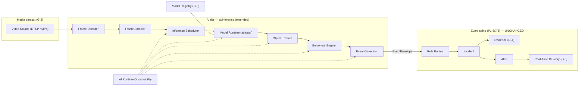

# AI Execution Architecture — the reference for all AI video-intelligence work

_Status: ⏳ Architect Review Pending · Author: Claude · Date: 2026-07-31 · **Reference architecture**_

> Commissioned at the **AI Processing Phase** kickoff (Architect authorization 2026-07-31, after G-5).
> With the foundational platform complete (**G-1 Camera · G-2 Media · G-3 Inference · G-4 Evidence ·
> G-5 Real-Time Delivery**), development now shifts from building infrastructure to **processing real
> video and generating meaningful AI-driven events** through the established contracts + EventEnvelope.
>
> **This document is the single reference architecture for all future AI work** (Architect rec 1). It
> **consolidates and supersedes** the G-3.5 note [AI_PROCESSING_PIPELINE](AI_PROCESSING_PIPELINE.md)
> and the proposed `AI_RUNTIME_INTEGRATION.md` (G-4 rec 5) into one canonical source — deliberately, to
> avoid the doc-drift risk (AR-7) of three overlapping pipeline notes. The older note remains as a
> historical pointer; **cite this file going forward.**
>
> Frozen anchors: [05-CAPABILITY-ARCHITECTURE](../05-CAPABILITY-ARCHITECTURE.md),
> [08-AI-ML-PLATFORM](../08-AI-ML-PLATFORM.md), [09-EVENT-PLATFORM](../09-EVENT-PLATFORM.md),
> [phase1/AI_PIPELINE](../phase1/AI_PIPELINE.md); ADR-0002 (model-agnostic), ADR-0012 (adapter layer).
> Implementation seams already shipped: [`ai/inference`](../../../ai/inference/) (P1-6 + G-3), the event
> spine [`services/*`](../../../services/) (P1-5/7/8), Evidence (G-4), Real-Time Delivery (G-5).

---

## 1. Principle: AI is additive behind the contracts, not new infrastructure

The platform is complete. AI capabilities **plug into the existing seams** and must not spawn new
platform services or disturb the validated spine:

- **Input** to the AI tier: a video source (RTSP or MP4) owned by **Media** (G-2).
- **Output** of the AI tier: **only** standardized `EventEnvelope`s published to the backbone (G-3
  boundary — the runtime never creates incidents/alerts). Everything downstream (rules → incident →
  evidence → alert → real-time dashboard) is already built and unchanged.
- **Home:** the Python **`ai/inference`** runtime (extended), never a new Node service. This upholds the
  Architect's standing guidance: _avoid infrastructure expansion unless driven by validated scalability
  requirements._

## 2. Stage responsibilities (Architect rec 1)

Each stage is a single-responsibility unit with a typed input/output; stages compose (hexagonal, DI —
the same discipline as the services). **Bold** stages exist today; others are the AI-phase build-out.

| #   | Stage                | Responsibility                                                            | Input → Output               | Status / seam                                                                                                                                      |
| --- | -------------------- | ------------------------------------------------------------------------- | ---------------------------- | -------------------------------------------------------------------------------------------------------------------------------------------------- |
| 1   | **Video Source**     | Own the RTSP/MP4 stream + credentials + reconnect                         | source → frames (raw)        | **exists** (Media `StreamSupervisor`, G-2)                                                                                                         |
| 2   | Frame Decoder        | Decode container/codec → raw frames (ffmpeg/OpenCV)                       | bytes → `Frame(ndarray, ts)` | partial (ffmpeg in Media; OpenCV decode to be added)                                                                                               |
| 3   | Frame Sampler        | Down-sample to a target FPS / keyframe stride; drop under load            | frames → sampled frames      | new (config-driven `expectedFps`)                                                                                                                  |
| 4   | Inference Scheduler  | Batch/queue frames to the runtime; backpressure; per-camera fairness      | frames → inference requests  | new (behind the unchanged `/infer` + `ModelAdapter`)                                                                                               |
| 5   | **Model Runtime**    | Run a model via an engine adapter; emit generic detections                | frame → `Detection[]`        | **exists** (`ModelAdapter`: Fake + ONNX; `EngineRegistry`, G-3)                                                                                    |
| 6   | **Object Tracker**   | Associate detections → continuous `Track`s (swappable engine + lifecycle) | detections → `Track[]`       | **exists (AI-2)** — `TrackerAdapter` (assoc-only) + `TrackManager` (lifecycle); `IouAssociator` default; ByteTrack/DeepSORT/… behind the same seam |
| 7   | Behaviour Engine     | Stateful, windowed analysis over tracks/zones (loiter, queue, intrusion)  | tracks → behaviour signals   | new ([AI_PROCESSING_PIPELINE §3](AI_PROCESSING_PIPELINE.md); TD-14)                                                                                |
| 8   | **Event Generator**  | Map detections/behaviours → canonical `EventEnvelope`                     | signals → `EventEnvelope`    | **exists** (`detections_to_events`, G-3; label-map gap TD-13)                                                                                      |
| 9   | **Event Publishing** | Publish to the tenant-partitioned backbone                                | `EventEnvelope` → NATS       | **exists** (`NatsEventSink`, G-3)                                                                                                                  |

**Inference Adapter boundary** (ADR-0012, formalized at G-3.5): every engine (YOLO/ONNX/TensorRT/
OpenVINO/TorchScript/custom) sits behind `ModelAdapter` and emits only generic `Detection`s, so the
spine stays engine-agnostic. New models integrate by **manifest**, not code (target state; today the
label→type map is partly hardcoded — TD-13).

## 3. Better approaches adopted on top of the recommendations

The Architect invited stronger approaches where available. These are the deliberate choices layered on
the six recommendations:

1. **One canonical AI doc, not three.** This file consolidates the G-3.5 pipeline note and the proposed
   `AI_RUNTIME_INTEGRATION.md` (rec 5, G-4) — one reference, cross-linked to frozen anchors. _(Avoids
   AR-7 doc drift.)_
2. **The AI Playground IS the deterministic integration harness.** Rather than a throwaway demo tool
   (rec 2), the playground drives the **real** pipeline on an MP4 and is reused as the phase's
   deterministic test harness — exactly how `tools/e2e` (G-3.5) exercised the event spine with no live
   camera. One investment validates models **and** gates CI.
3. **Deterministic-by-default, real-model-by-config.** Keep the **stub `FakeAdapter`** as the default
   test path (fixed detections → fixed events, no GPU, no model files); real ONNX/YOLO runs
   integration-only behind the same `ModelAdapter` seam. Preserves the platform's camera-free,
   deterministic testing standard (G-3).
4. **Extend, don't fork, the G-3 contracts.** AI runtime observability (rec 3) extends the existing
   `RuntimeMetrics`; registry enhancement (rec 4) extends `ModelRegistration`/`ModelCapabilityProfile`
   — **additively, backward-compatible** (Constitution §7), never a parallel registry.
5. **Reuse the whole platform end-to-end.** Detections flow through the **existing** rules→incident→
   evidence→alert→G-5 real-time path untouched; AI-generated evidence attaches via the G-4
   `IncidentEvidenceExtractor` seam (TD-15), and live results reach the console over the G-5 `events`/
   `system` topics. No new wiring invented.
6. **Behaviour analysis stays stateful in the AI tier; the spine stays stateless.** Windowed state keyed
   per-`(tenant,camera,track/zone)` lives in the Behaviour Engine and emits higher-order `EventEnvelope`s
   (recovery via replay) — the validated spine never becomes stateful.

## 4. AI Playground (Architect rec 2) — internal engineering tool

**Purpose:** validate a model on real footage before it touches production workflows. **Not
customer-facing.**

**Placement (recommended):** a thin **`POST /playground/analyze`** endpoint in `ai/inference` (internal-
key gated, `x-tenant-id`, same as `/infer`) that runs the real pipeline on an uploaded/mounted MP4 and
returns a structured result (detections + tracks + generated `EventEnvelope`s + per-frame boxes +
timings), plus a **minimal internal viewer** under `apps/` **only if** a UI is warranted — otherwise a
`tools/` CLI that writes an annotated MP4 + `events.json`. Rationale: the value is in exercising the
**real** stages deterministically; a heavy UI is deferred until the pipeline earns it.

**Capabilities (built incrementally with the pipeline):** upload MP4 · select model · set confidence ·
run inference · view bounding boxes · inspect object tracks · review generated events · replay
timelines · validate rule matches (by feeding the events through the real rule engine, dry-run).

## 5. AI Runtime Observability (Architect rec 3)

Extend the existing G-3 `RuntimeMetrics` + Python `metrics.py` (deterministic, GPU-probe already
present) with the AI-execution counters, surfaced on the existing `/metrics` and as `system.*` events
on the G-5 `system` topic:

inference FPS · frame-processing rate · model latency (avg/p50/p95) · GPU/CPU utilization · frame-queue
depth · **dropped frames** · tracking latency · behaviour-analysis latency · event-generation latency.

These become the production performance-tuning surface; they extend a shipped contract additively.

## 6. Model Registry enhancement (Architect rec 4)

Extend the G-3 `ModelRegistration` / `ModelVersion` / `ModelCapabilityProfile` **additively** with
deployment-focused metadata (all optional → backward-compatible):

model version · framework · runtime/engine · input resolution · supported labels · confidence defaults ·
**performance benchmarks** (fps/latency on reference hardware) · hardware requirements · supported camera
FPS · **deployment status** (registered → validated → staged → deployed → retired).

Feeds the AI Playground (which model to run) and future model management/upgrades; no new registry.

## 7. Incremental delivery plan (Architect rec 5) — milestones AI-1 … AI-4

Each milestone produces a **demonstrable, testable** outcome and stops for review before the next
(the G-1…G-5 rhythm). Named AI-1…AI-4 to avoid colliding with the program's Phase numbers.

| Milestone | Outcome (demonstrable)                                                            | New stages                                                                  | Key deliverable                                                                                                                |
| --------- | --------------------------------------------------------------------------------- | --------------------------------------------------------------------------- | ------------------------------------------------------------------------------------------------------------------------------ |
| **AI-1**  | MP4 → **person detection** → bounding boxes → `EventEnvelope` on the backbone     | Decoder, Sampler, Scheduler (min), Event Generator wired to real detections | the pipeline skeleton + **AI Playground** (analyze an MP4, see boxes + events); stub-deterministic, ONNX-YOLO integration-only |
| **AI-2**  | **Object tracking** + zone detection + entry/exit counting                        | Object Tracker; zone model + counting                                       | stable `trackId`s; `analytics.people.count`, zone entry/exit events                                                            |
| **AI-3**  | Queue monitoring · loitering · fire · intrusion                                   | Behaviour Engine (windowed)                                                 | `behavior.loitering`, `analytics.queue.length`, `safety.fire.detected`, intrusion (after-hours)                                |
| **AI-4**  | Behaviour analytics · cash-counter monitoring · retail theft · customer workflows | Behaviour Engine (advanced) + packs                                         | the retail pilot (§8), customer-specific rules/workflows                                                                       |

**AI-1 is the next slice** and is planned for the Architect's plan-approval gate before implementation.

## 8. Customer pilot workflow (Architect rec 6) — retail reference deployment

The first real-world target that guides AI feature prioritization (drives AI-2…AI-4). All via config +
Packs (industry semantics stay out of the core, Law 1):

| Camera | Location     | AI capability                                          |
| ------ | ------------ | ------------------------------------------------------ |
| 1      | Entrance     | entry/exit counting                                    |
| 2      | Shop floor   | customer monitoring · queue detection                  |
| 3      | Cash counter | cash-handling analysis · suspicious-activity detection |
| 4      | Exit         | occupancy validation                                   |

Development stays aligned to this measurable customer value; each capability lands in the AI-2…AI-4
milestones and is demonstrated on the pilot layout.

## 9. Guardrails (unchanged through the AI phase)

Contract-first · clean/hexagonal architecture + SOLID · transport independence · **deterministic
testing** (stub-default) · documentation-first governance · **multi-tenant isolation** · immutable
evidence · **event-driven only** (AI emits `EventEnvelope`, nothing more) · configuration over
hardcoding · backward-compatible evolution · **no new infrastructure service** without validated scale
need · **no frozen-doc (01–28) change**. The runtime boundary (G-3) holds: **the AI tier never creates
incidents or alerts** — it publishes events and the validated spine does the rest.

## 10. Status

Reference architecture produced as **documentation** for the AI Processing Phase. It records the target
design, folds in all six Architect recommendations, and defines the incremental milestones AI-1…AI-4. **No
code, no frozen-doc (01–28) change, no new service.** The **AI-1 first-slice plan** follows for the
Architect's plan-approval gate before any computer-vision implementation begins.
