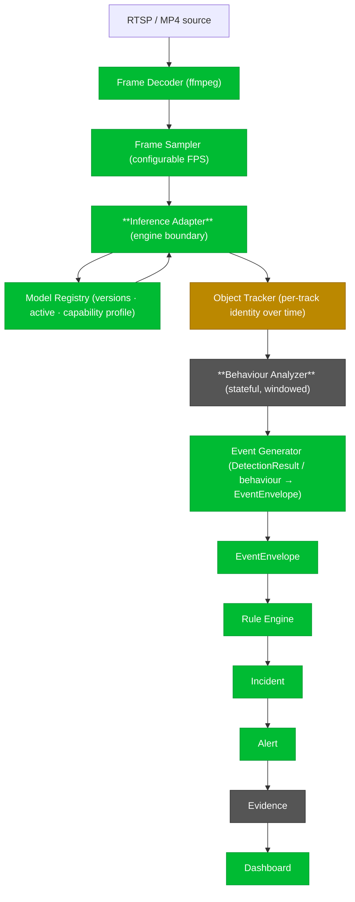
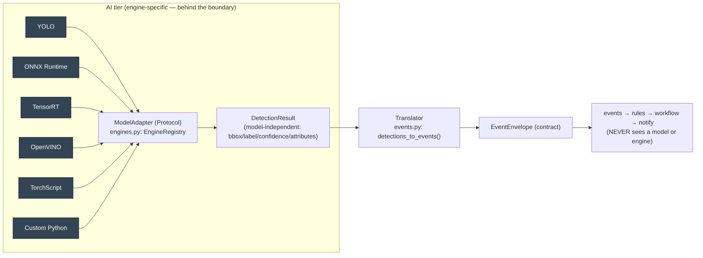
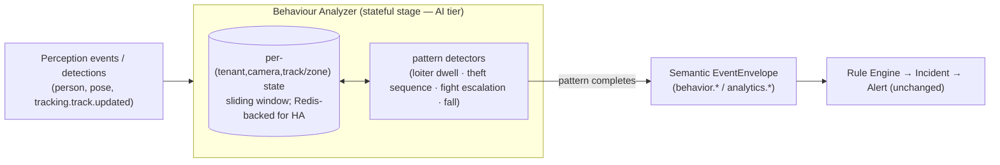

# Future AI Processing Pipeline — Inference Adapter Boundary & Behaviour Workflows

_Status: ⏳ Architect Review Pending · Author: Claude · Date: 2026-07-30 · **Documentation-only**_

> Commissioned at **G-3.5 closeout** (Architect recommendations 4–5 + the "future AI processing
> pipeline" note). Documents the **target modular pipeline** and two boundaries that keep the platform
> **engine-independent and AI-ready** — **no implementation, no frozen-doc change (01–28)**. Grounds
> every stage in what already exists so future AI work is additive.
>
> Frozen anchors: [05-CAPABILITY-ARCHITECTURE](../05-CAPABILITY-ARCHITECTURE.md),
> [08-AI-ML-PLATFORM](../08-AI-ML-PLATFORM.md), [phase1/AI_PIPELINE](../phase1/AI_PIPELINE.md);
> ADR-0002 (model-agnostic), ADR-0012 (adapter layer). Implementation: [`ai/inference`](../../../ai/inference/)
> (P1-6 + G-3), the event spine [`services/*`](../../../services/) (P1-5/7/8).

---

## 1. The target pipeline (end-to-end)

### Stage status (grounded)

| Stage                                   | Status          | Where it lives                                                        |
| --------------------------------------- | --------------- | --------------------------------------------------------------------- |
| Frame Decoder                           | ✅ P1-4         | media service (ffmpeg workers)                                        |
| Frame Sampler (configurable FPS)        | ✅ P1-4/P1-6    | capture config (`capture.fps`) → FrameContext                         |
| **Inference Adapter**                   | ✅ P1-6 seam    | `ModelAdapter` Protocol + `EngineRegistry` (see §2)                   |
| Model Registry                          | ✅ G-3          | `ai/inference/model_registry.py` (versions/active/capability profile) |
| Object Tracker                          | 🟠 partial      | `Detection.trackingId` carried; a dedicated tracker stage is future   |
| **Behaviour Analyzer**                  | ⏳ future       | stateful stage (see §3); emits `behavior.*`/`analytics.*`             |
| Event Generator                         | ✅ P1-5/G-3     | `events.py` (`detections_to_events`) + events-service normalizer      |
| EventEnvelope → Rule → Incident → Alert | ✅ P1-5/7/8     | events → rules → workflow → notify (validated in **G-3.5**)           |
| Evidence                                | ⏳ **G-4 next** | Evidence APIs resolve `evidenceRefs` + clip/snapshot                  |
| Dashboard                               | ✅ P2-1         | Operations Console                                                    |

**Everything left of `EventEnvelope` is the AI tier; everything right of it is the (validated,
engine-agnostic) event spine.** The two are joined by exactly one contract: `EventEnvelope`.

---

## 2. Inference Adapter Boundary (recommendation #5)

**Principle:** _AI runtimes publish standardized `EventEnvelope` objects through an adapter; the
downstream event spine stays completely AI-engine agnostic._

### 2.1 What exists today

The boundary is already a seam in the P1-6 runtime — G-3 formalized both ends:

- **Inbound adapter:** [`ModelAdapter`](../../../ai/inference/pipeline.py) Protocol — every engine
  implements the same `preprocess/infer` surface; [`EngineRegistry`](../../../ai/inference/engines.py)
  resolves an engine name (`yolo|onnx|tensorrt|openvino|torchscript|python-custom`, from the model's
  `engine` field) → an adapter factory. **YOLO is not special-cased.**
- **Model-independent output:** `Detection` carries `bbox/label/confidence/attributes/embedding/trackingId`
  — **no vendor fields**.
- **Outbound translator:** [`detections_to_events()`](../../../ai/inference/events.py) is the **only**
  place model output becomes a domain event → `EventEnvelope`. The runtime **never** creates incidents
  (asserted; proven in G-3.5).

### 2.2 Target (what to formalize before real-model integration)

1. **A single standardized output — `EventEnvelope`.** Every capability, on every engine, emits only
   `EventEnvelope` through the translator. Downstream code (events/rules/workflow/notify) already
   depends on nothing else — keep it that way.
2. **Capability-manifest-driven type mapping.** Today `events.py`/the Node normalizer hold a label→type
   map (person/vehicle/fire/smoke). Make the mapping **declared per capability** in its manifest +
   G-3 `ModelCapabilityProfile.supportedEventTypes`, so a new model reaches the full catalog without a
   code change (this closes **[TD-13](../../../tracking/TECH-DEBT.md)** and the G-3.5 report's TD-1/TD-2).
3. **The spine never imports an engine.** Enforced structurally: `ai/inference` is a separate (Python)
   process; the Node services consume only `EventEnvelope` off the bus. New engines register a factory
   — no downstream change.

**Tracked as [TD-13](../../../tracking/TECH-DEBT.md).**

---

## 3. Long-Running Behaviour Workflows (recommendation #4)

**Problem.** Loitering, theft, fight, fall, PPE-over-time, queue trends — these are **stateful over
time/frames**, not single-frame detections. The current spine is **stateless per event** (the only
state is the Rule Engine's time-windowed threshold count — [TD-7](../../../tracking/TECH-DEBT.md)).

**Architectural direction (no implementation now).**

Design rules:

1. **Statefulness stays in the AI tier, not the spine.** The Behaviour Analyzer sits **between** Object
   Tracker and Event Generator (§1). It consumes low-level perception + tracking, maintains per-unit
   windowed state, and **emits a higher-order `EventEnvelope`** (`behavior.loitering.detected`,
   `behavior.theft.suspected`, `behavior.fight.detected`, `analytics.queue.length`, …) **only when a
   pattern completes**. These catalog types **already exist** (added in G-3).
2. **The event spine remains stateless and reactive.** Rules/workflow/notify treat a behaviour event
   like any other `EventEnvelope` — no change to the validated spine.
3. **State is keyed by the unit that needs order** (`tenant+camera+track` or `tenant+camera+zone`),
   partitioned so per-track order holds locally (ties to [EVENT_SPINE_SEMANTICS §3.4](EVENT_SPINE_SEMANTICS.md#34-distributed-deployment-considerations)).
   In-process sliding window first (like the Rule Engine's), Redis for cross-replica/durable state;
   **recovery via event replay** (deterministic, per G-3.5).
4. **Packaged as capabilities.** Each analyzer is a manifest-declared capability (composable per
   [ANALYSIS_PROFILES](ANALYSIS_PROFILES.md), scheduled per [INFERENCE_SCHEDULER](INFERENCE_SCHEDULER.md)) —
   it reuses the same Inference Adapter output boundary (§2), so behaviour analytics are engine-agnostic too.

**Tracked as [TD-14](../../../tracking/TECH-DEBT.md).**

---

## 4. Why this keeps the platform modular & AI-ready

- **One join point.** AI tier ⟷ event spine meet only at `EventEnvelope`; either side evolves
  independently.
- **Engine independence.** Every runtime (person detection, queue monitoring, fire, PPE, theft, custom)
  enters through the Inference Adapter and leaves as `EventEnvelope` — the spine never learns an engine.
- **Stateful analytics without spine changes.** Behaviour workflows encapsulate their state in the AI
  tier and publish standardized events, so incident/alert/evidence logic is untouched.
- **Validated foundation.** G-3.5 proved the `EventEnvelope → Rule → Incident → Alert → Dashboard` half
  end-to-end; this note describes how the **AI half** plugs into it without disturbing the invariants
  (versioning, dedup, ordering, tenant isolation, traceability).

_No code is written here. These are the boundaries G-4 (Evidence) and future AI enablers build against._
