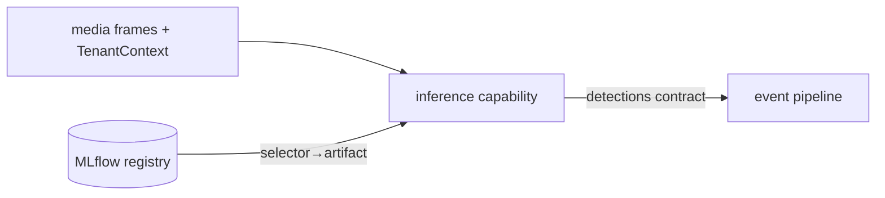

# Phase 1 — AI Inference Pipeline

> Grounds P1-6 in [05-CAPABILITY-ARCHITECTURE](../05-CAPABILITY-ARCHITECTURE.md), [08-AI-ML-PLATFORM](../08-AI-ML-PLATFORM.md), [ADR-0002](../../adr/ADR-0002-model-agnostic-inference.md) (model-agnostic), [ADR-0012](../../adr/ADR-0012-model-adapter-layer.md).

## Purpose

Run perception over frames **without hardcoding any model** — one capability, one model, proving the model-agnostic runtime end-to-end.

## Responsibilities

- Implement the **capability contract**: `descriptor + init/process/health/dispose` ([05](../05-CAPABILITY-ARCHITECTURE.md)).
- Bind a concrete model by **selector** (`{task, family, version-range, accelerator}`) from the registry via the Model Adapter Layer ([08 §8a](../08-AI-ML-PLATFORM.md)).
- Consume frames, run inference (one capability: person/object detection), emit normalized outputs (class, confidence, bbox) per contract.
- Self-register/describe; expose health + metrics.

## Components

| Component                       | Role                                              |
| ------------------------------- | ------------------------------------------------- |
| `inference` (Python) capability | contract impl + pre/post-processing               |
| Model Adapter                   | selector → concrete artifact (ONNX/… from MLflow) |
| Registry client                 | `ai/mlops` config → MLflow model resolution       |

## Data flow

## APIs (Phase 1)

- Internal gRPC `Infer(frame, context) → detections` (contract in `@vip/contracts`).
- Capability descriptor endpoint/manifest (task, inputs/outputs, params, placement, resource profile).

## Dependencies

P1-4 (frames), Phase 0 MLOps registry (a registered model), `@vip/contracts` (capability + detection schema), `ai/mlops` config. Python runtime formalizes here (deferred from Phase 0).

## Failure handling

- Model load/selector-resolution failure → capability unhealthy (`/health`), no partial output.
- Inference error on a frame → skip frame, count metric, continue; never crash the stream.
- Registry unreachable → use last-resolved pinned artifact; alert.

## Scaling strategy

- Stateless per request; GPU/CPU worker pools autoscaled on inference queue depth; batch **within a tenant** only (no cross-tenant batching, [TENANT_ARCHITECTURE §10](TENANT_ARCHITECTURE.md)). Edge or cloud placement is a scheduler decision from one codebase ([ADR-0004](../../adr/ADR-0004-edge-first-placement.md)). Phase 1: CPU/ONNX, batch=1.

## Security considerations

- The capability **persists no tenant data** (frames/embeddings); outputs return as tenant-tagged events. Frame + `TenantContext` travel together; a frame without context is dropped fail-closed. Models are shared, data is not.

## Future extension points

- Multiple capabilities (spatial/reasoning), the full model marketplace + trust tiers ([08 §8](../08-AI-ML-PLATFORM.md)), TensorRT/OpenVINO edge exports, model-CI FP/FN gates before promotion, per-tenant fine-tunes, re-ID embedding stores (per-tenant namespaces).
