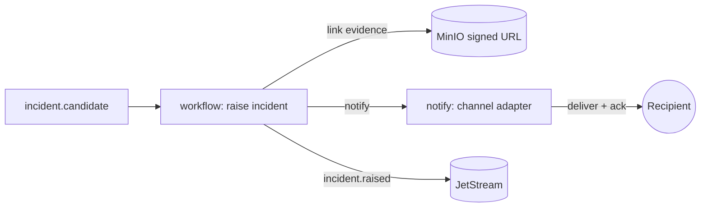

# Phase 1 — Alert Engine (Incidents & Notification)

> Grounds P1-8 in [11-WORKFLOW-ENGINE](../11-WORKFLOW-ENGINE.md), [12-EVIDENCE-MANAGEMENT](../12-EVIDENCE-MANAGEMENT.md). Closes the vertical: an incident candidate becomes a **delivered alert**.

## Purpose

Manage the incident lifecycle and deliver alerts reliably — the platform's visible output.

## Responsibilities

- **Incident lifecycle** (`workflow`): candidate → raised → acknowledged → resolved; escalation; link evidence (clip/snapshot ref from `media`).
- **Delivery** (`notify`): send on one channel (email/webhook first; multi-channel interface); ack tracking; retry + dead-letter; per-tenant rate limits.
- Publish `incident.raised`, `workflow.escalated`; record deliveries.

## Components

| Component          | Role                                                           |
| ------------------ | -------------------------------------------------------------- |
| `workflow` service | incident state machine, escalation, evidence linking           |
| `notify` service   | channel adapters (email/webhook first), retry/dead-letter, ack |
| Evidence ref       | signed-URL to the recording/snapshot from `media`              |

## Data flow

## APIs (Phase 1)

- `GET /incidents`, `GET /incidents/:id`, `POST /incidents/:id/ack`, `POST /incidents/:id/resolve` (tenant-scoped).
- Consume: `incident.candidate`, `rule.matched`. Deliver: one channel; `POST /notifications/test`.

## Dependencies

P1-7 (candidates), P1-4 (evidence refs), P1-2 (recipients + authz), Redis (state/rate limits), external email/webhook provider (via config).

## Failure handling

- Channel/provider down → **retry with backoff → dead-letter**; incident stays raised; alert on delivery failure.
- Duplicate candidates → alert **dedup**/coalescing per incident.
- Notification storm → per-tenant rate limits + aggregation.
- Ack lost → escalation timer fires.

## Scaling strategy

Stateful workflow instances horizontal by tenant; `notify` workers per channel; idempotent delivery; dead-letter queue drained separately.

## Security considerations

- Tenant-scoped incidents + recipients; evidence via short-lived signed URLs only; no PII in logs; delivery content minimized; rate limits prevent abuse.

## Future extension points

- Full multi-channel (SMS/WhatsApp/voice/Slack/Teams via the Connector Platform, [25](../25-CONNECTOR-PLATFORM.md)), case management, SLA/escalation policies, command center UI ([11](../11-WORKFLOW-ENGINE.md)), evidence export + chain-of-custody ([12](../12-EVIDENCE-MANAGEMENT.md)).

## Implemented (P1-8)

Realized as **two services** matching the frozen bounded contexts (22/23) — merging them would
violate service ownership. See [`@vip/service-workflow`](../../../services/workflow/README.md) +
[INCIDENT_LIFECYCLE](INCIDENT_LIFECYCLE.md) (lifecycle) and
[`@vip/service-notify`](../../../services/notify/README.md) (the Alert Engine), and
[ED-0029](../../project/ENGINEERING_DECISION_LOG.md).

- **workflow** — consumes `incident.candidate`, idempotently promotes to a `raised` Incident (unique
  `(tenant, dedupKey)`), drives `raised→acknowledged→resolved→closed` (illegal moves 409; versioned +
  `history[]` audited), publishes `incident.raised|acknowledged|resolved|closed`. Required
  end-to-end `correlationId` (rec 1).
- **notify** (the Alert Engine) — consumes **`incident.raised`** (Incident contracts only, rec 3),
  selects enabled channels meeting the incident's severity floor, delivers per channel via a
  `ChannelSender` (**`in-app` + `webhook`** in Phase 1), records a delivery log, publishes
  `notification.sent|delivered|failed`, and supports recipient **ack** (`notification.acked`).
  Idempotent per `(tenant, incident, channel)`; loop-free (publishes onto the `NOTIFICATIONS` stream
  it never consumes).
- **Deferred** (→ [TD-8](../../../tracking/TECH-DEBT.md)): escalation/on-call/cases + hash-chained
  audit; the workflow↔notify ack feedback loop; email/SMS/push senders; delivery retry/backoff/DLQ +
  per-tenant rate limits; evidence-ref linking from `media`.
