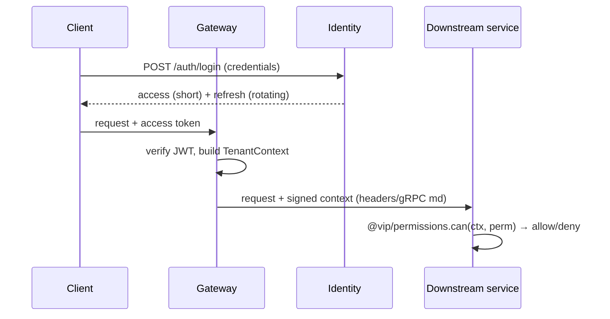

# Phase 1 — Authentication & Authorization

> Grounds P1-2 in [15-SECURITY](../15-SECURITY-ARCHITECTURE.md), [28-POLICY-ENGINE](../28-POLICY-ENGINE.md), [06-MULTI-TENANT-SAAS](../06-MULTI-TENANT-SAAS.md). Uses the `@vip/config` `jwt` group and the `@vip/contracts` `TenantContext`.

## Purpose

Prove who a principal is, mint the tenant context, and decide what they may do — the single trust boundary for the platform.

## Responsibilities

- **AuthN:** OIDC/JWT with access + refresh tokens; refresh **reuse-detection**; MFA-ready; API keys (interface). Owned by `identity`.
- **Context minting:** turn a valid principal + tenant into a `TenantContext`.
- **AuthZ:** RBAC (roles→permissions) + ABAC (scopes) via `@vip/permissions` (a Policy Decision Point stub).
- **Edge enforcement:** the `gateway` validates every request and forwards trusted context.

## Components

| Component                 | Role                                                                |
| ------------------------- | ------------------------------------------------------------------- |
| `identity` service        | credentials (argon2), sessions, token issue/refresh/revoke, MFA     |
| `gateway` service         | token validation, tenant-context resolution, rate limit, routing    |
| `@vip/permissions` (pkg)  | permission model + PDP check (`can(context, permission, resource)`) |
| `@vip/config` `jwt` group | secret + TTLs (`.env`, ADR-0018)                                    |

## Data flow

## APIs (Phase 1)

- `POST /auth/login`, `POST /auth/refresh`, `POST /auth/logout`, `GET /auth/me`
- `POST /users`, `GET /users` (tenant-scoped), `POST /api-keys`
- All public via `gateway` (REST/OpenAPI from `@vip/contracts`); internal identity calls via gRPC.

## Dependencies

P1-1 (tenant to scope principals + mint context); Phase 0 `@vip/config`, `@vip/contracts`, Mongo (users/sessions), Redis (session/refresh state).

## Failure handling

- Invalid/expired token → 401 at gateway; no context.
- Refresh reuse detected → revoke the whole token lineage (compromise response).
- Identity down → gateway fails closed (deny); cached public keys allow read-only token verification briefly.
- Permission check error → deny.

## Scaling strategy

Stateless services (HPA); session/refresh state in Redis (tenant-prefixed); token verification is CPU-only and horizontally scalable.

## Security considerations

- Argon2 password hashing; secrets from `.env`/injected env (no external manager, ADR-0018); short access TTL + rotating refresh; MFA-ready; audit of auth events (hash-chained audit is Phase 3).
- Deny-by-default authorization; least-privilege scopes; no tokens/PII in logs.

## Future extension points

- SSO/external IdP federation; full MFA; the complete Policy Engine (PDP/PEP) behind `@vip/permissions`; per-tenant KMS for token signing keys (optional, later).
