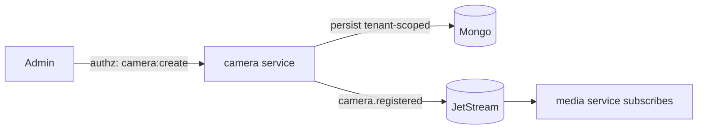

# Phase 1 — Camera Registry & Org Hierarchy

> Grounds P1-3 in [22-BOUNDED-CONTEXTS](../22-BOUNDED-CONTEXTS.md) (Camera/Inventory), [14-EDGE-PLATFORM](../14-EDGE-PLATFORM.md), [07-DATA-AND-PIPELINE-FLOWS](../07-DATA-AND-PIPELINE-FLOWS.md).

## Purpose

Model where cameras live (the location hierarchy) and onboard them with vaulted credentials, so ingestion and every downstream event can be scoped to a place.

## Responsibilities

- Own the hierarchy `org → region → country → branch → site → building → floor → zone → camera`.
- Camera onboarding (manual RTSP/RTMP; ONVIF discovery interface stubbed), capture profile (resolution/FPS/codec/PTZ), zone/line definitions.
- Camera **credential vaulting** (encrypted at rest) and health status.
- Publish `camera.registered|updated|removed`, `camera.health.*`.

## Components

| Component                    | Role                                                              |
| ---------------------------- | ----------------------------------------------------------------- |
| `camera` (inventory) service | hierarchy + camera CRUD, onboarding, health                       |
| Hierarchy model              | tree of location nodes; a camera belongs to exactly one zone/site |
| Credential store             | camera creds encrypted with an app key (`.env`, ADR-0018)         |

## Data flow

## APIs (Phase 1)

- Hierarchy: `POST/GET/PATCH /orgs`, `/sites`, `/zones` (tenant-scoped).
- Cameras: `POST /cameras`, `GET /cameras`, `PATCH /cameras/:id`, `GET /cameras/:id/health`.
- Credentials are write-only (never returned); ONVIF discovery `POST /cameras/discover` (stub).

## Dependencies

P1-1 (tenant scoping), P1-2 (authz to manage). Emits events consumed by `media` (P1-4).

## Failure handling

- Invalid hierarchy (orphan node / camera in two zones) → validation error.
- Duplicate camera (same RTSP under a tenant) → idempotent upsert or conflict.
- Credential decryption failure → camera marked unhealthy; no plaintext leak.

## Scaling strategy

Stateless CRUD service (HPA); handles thousands of cameras per tenant; hierarchy reads cached in Redis (tenant-prefixed). Onboarding campaigns batched.

## Security considerations

- Tenant + zone scoping on every record; camera credentials encrypted at rest, never in responses/logs; assignment authorization via `@vip/permissions`.

## Future extension points

- Full ONVIF/WS-Discovery auto-onboarding ("add a camera, see live in <60s"), PTZ control, edge-device binding + OTA ([14-EDGE-PLATFORM](../14-EDGE-PLATFORM.md)), capability assignment per camera/zone.
