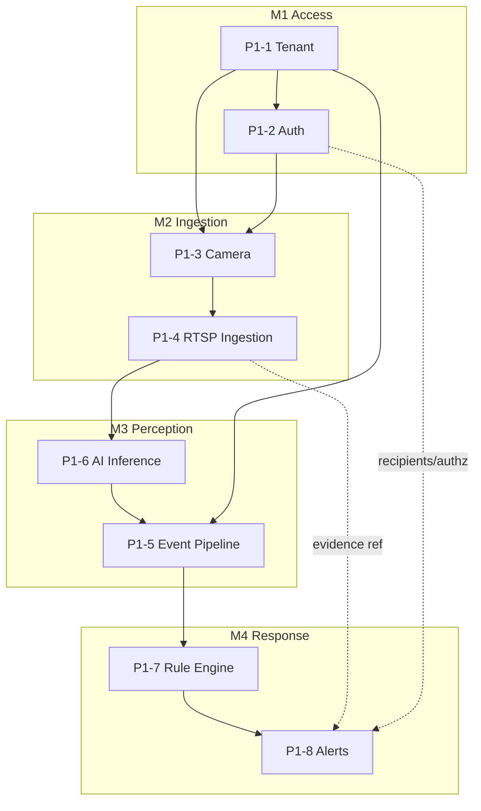

# Phase 1 — Dependency Graph

> Phase → Milestones → Slices → Services → Modules, and what can run in parallel vs. what must come first. Complements [ROADMAP](ROADMAP.md) and [IMPLEMENTATION_ORDER](IMPLEMENTATION_ORDER.md). The runtime service DAG must stay acyclic ([23-SERVICE-OWNERSHIP](../23-SERVICE-OWNERSHIP.md)); `check:imports` enforces the code boundaries.

## Slice dependency graph



## Level breakdown

| Level              | Items                                                                                                                |
| ------------------ | -------------------------------------------------------------------------------------------------------------------- |
| **Phase**          | Phase 1 — Core Platform                                                                                              |
| **Milestones**     | M1 Access · M2 Ingestion · M3 Perception · M4 Response                                                               |
| **Slices**         | P1-1 … P1-8                                                                                                          |
| **Services**       | `tenant`, `gateway`, `identity`(extend), `camera`, `media`, `inference`(py), `events`, `rules`, `workflow`, `notify` |
| **Shared modules** | `@vip/contracts`(extend), `@vip/config`(reuse), `@vip/tenancy`(new), `@vip/permissions`(new)                         |

## Service runtime data path (must stay acyclic)

```text
Camera ─▶ media ─▶ inference ─▶ events ─▶ rules ─▶ workflow ─▶ notify
                                   ▲
gateway ─▶ (identity, tenant, camera)  ── control-plane reads point "inward"
```

## What must come first (critical path)

`@vip/tenancy` + `tenant` (P1-1) → everything. `@vip/contracts` extensions precede each consuming slice (contract-first). The **critical path** to the demo is: **P1-1 → P1-2 → P1-3 → P1-4 → P1-6 → P1-5 → P1-7 → P1-8**.

## What can be parallelized

Once **P1-1 is merged**, these can proceed concurrently by different workers/agents:

| Parallel track                                     | After                         | Notes                                      |
| -------------------------------------------------- | ----------------------------- | ------------------------------------------ |
| `@vip/permissions` (P1-2 authz module)             | P1-1                          | independent of camera/media                |
| Camera hierarchy model (P1-3)                      | P1-1 (+P1-2 for authz wiring) | contract + CRUD can start early            |
| RTSP test source + decode spike (P1-4)             | P1-3 contract                 | infra/spike parallel to camera CRUD        |
| `inference` capability skeleton (P1-6)             | contract + Phase 0 registry   | Python runtime setup is independent        |
| Event/rule/alert **contracts** in `@vip/contracts` | P1-1                          | schemas can be authored ahead of consumers |
| [OBSERVABILITY](OBSERVABILITY.md) wiring           | each service as built         | cross-cutting, incremental                 |

**Serialized (cannot parallelize):** the live data path P1-4→P1-6→P1-5→P1-7→P1-8 (each consumes the previous stage's real output) and anything touching the tenant guard before P1-1 lands.

## Contract-first ordering (per slice)

For every slice: **extend `@vip/contracts` → generate types → implement producers/consumers → test**. A consumer is never built before its contract exists.
