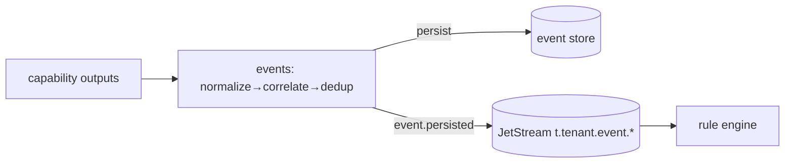

# Phase 1 — Event Pipeline

> Grounds P1-5 in [09-EVENT-PLATFORM](../09-EVENT-PLATFORM.md), [ADR-0016](../../adr/ADR-0016-nats-jetstream-event-backbone.md) (NATS JetStream), [18-DATA-ARCHITECTURE](../18-DATA-ARCHITECTURE.md). The `EventEnvelope` contract already exists in `@vip/contracts`.

## Purpose

Turn capability outputs into **normalized, correlated, deduplicated, durable** events — the backbone everything else reacts to.

## Responsibilities

- Consume capability/detection outputs; normalize to `EventEnvelope` ([contract](../../../packages/contracts/src/events/envelope.ts)).
- Correlate (same object/scene) and deduplicate; persist to Mongo; publish `event.persisted`.
- Support **replay** from the durable log; enforce tenant-scoped subjects.

## Components

| Component           | Role                                                   |
| ------------------- | ------------------------------------------------------ |
| `events` service    | normalize, correlate, dedup, persist, publish, replay  |
| JetStream           | durable, tenant-scoped subjects `t.{tenantId}.event.*` |
| Event store (Mongo) | persisted envelopes (tenant-indexed)                   |

## Data flow

## APIs (Phase 1)

- Consume: capability output subjects. Publish: `event.persisted`.
- `GET /events` (tenant-scoped query), `POST /events/replay` (bounded, admin).

## Dependencies

P1-6 (produces outputs), P1-1 (tenant subjects + records), Phase 0 NATS + Mongo + `@vip/contracts`.

## Failure handling

- Envelope missing `tenantId`/invalid → **dead-letter**, never processed ([TENANT_ARCHITECTURE §11](TENANT_ARCHITECTURE.md)).
- Duplicate delivery (at-least-once) → **idempotent** consumers (dedup key); safe re-processing.
- Persist failure → NAK/redeliver with backoff; poison messages to DLQ after N tries.
- Consumer lag → JetStream retains; horizontal consumers by tenant/camera partition.

## Scaling strategy

Partitioned by tenant/camera; consumer groups; horizontal. JetStream retention + replay decouple producers/consumers. Hot aggregates in Redis (tenant-prefixed).

## Security considerations

- Tenant subject isolation (no cross-tenant subscribe); mandatory `tenantId` validation on ingest; PII policy on payloads (PII class in the catalog); audit of event access is Phase 3.

## Future extension points

- Complex event processing / windows, correlation across cameras, embeddings for search (Phase 2), event-catalog growth, schema evolution via contract versioning.
