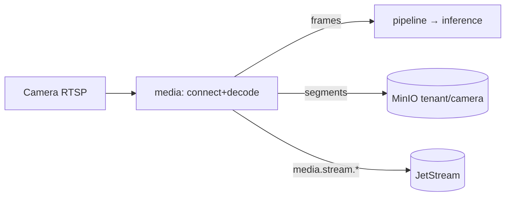

# Phase 1 — RTSP Ingestion Pipeline

> Grounds P1-4 in [07-DATA-AND-PIPELINE-FLOWS](../07-DATA-AND-PIPELINE-FLOWS.md), [14-EDGE-PLATFORM](../14-EDGE-PLATFORM.md), [12-EVIDENCE-MANAGEMENT](../12-EVIDENCE-MANAGEMENT.md), [19-PERFORMANCE-AND-SCALE](../19-PERFORMANCE-AND-SCALE.md).

## Purpose

Connect to a camera's RTSP stream, decode it, extract frames for perception, and record media to object storage — the source of everything downstream.

## Responsibilities

- RTSP/RTMP connect + authenticate (creds from `camera`), decode (H.264 first).
- Frame extraction at a configurable rate; hand frames to the perception pipeline.
- Ring-buffer + recording to MinIO (`{tenantId}/{cameraId}/…`); pre/post-roll for evidence.
- Health heartbeat, auto-reconnect; emit `media.stream.connected|lost`.

## Components

| Component       | Role                                                |
| --------------- | --------------------------------------------------- |
| `media` service | per-stream worker: connect, decode, extract, record |
| Decoder         | ffmpeg/GStreamer (H.264 → frames)                   |
| Frame bus       | in-process/shared handoff to `pipeline`/`inference` |
| Recorder        | ring buffer + segment writer → MinIO                |

## Data flow

## APIs (Phase 1)

- Internal gRPC/stream: `StartStream(cameraId)`, `StopStream`, frame subscription.
- `GET /streams/:cameraId/status` (via gateway); no public raw-frame API in Phase 1 (live view is later).

## Dependencies

P1-3 (camera + credentials), [STORAGE_ARCHITECTURE](STORAGE_ARCHITECTURE.md) (MinIO), P1-6 consumes frames. Dev stack gains an **RTSP test source** container.

## Failure handling

- Connect fail / stream loss → `media.stream.lost` + exponential-backoff reconnect.
- Decode error / codec unsupported → mark unhealthy, skip, alert; Phase 1 scopes to H.264.
- Back-pressure (perception slower than ingest) → drop-to-latest frame policy; recording is independent of perception.
- Storage write fail → retry; recording degraded flag; never blocks the live path.

## Scaling strategy

Per-stream workers; GPU/decoder-bound → scale by camera count; edge-first placement so decode runs near the camera and only frames/events traverse the network ([ADR-0004](../../adr/ADR-0004-edge-first-placement.md)). SFU/live fan-out is later.

## Security considerations

- Camera credentials used transiently, never logged; recordings written under the tenant prefix with signed-URL access only; tenant context carried on every frame/job (drops fail-closed if absent).

## Future extension points

- RTMP/WebRTC live view, HLS transcode, PTZ, multi-profile capture, edge ring-buffer + selective upload, hardware-accelerated decode.
