# Phase 1 — Observability

> Cross-cutting from M1. Grounds Phase 1 in [16-OBSERVABILITY](../16-OBSERVABILITY.md); extends the Phase 0 identity template (structured logs, `/health` `/ready` `/metrics`, correlation ids).

## Purpose

Make the end-to-end vertical **traceable, measurable, and debuggable** — every service observable by default, the whole camera→alert path followable by one correlation id.

## Responsibilities

- Uniform `/health` (liveness), `/ready` (dependency readiness), `/metrics` (Prometheus) on every service (established by the identity template).
- Structured logs (pino) with a **correlation id** propagated across HTTP, gRPC, and events.
- Golden-path metrics per stage (ingest FPS, inference latency, event throughput, rule eval time, alert delivery latency/success).
- Distributed tracing spans across the vertical (OpenTelemetry interface).

## Components

| Component                      | Role                                                         |
| ------------------------------ | ------------------------------------------------------------ |
| Service template               | `/health` `/ready` `/metrics` + pino + `genReqId` (Phase 0)  |
| `prom-client` registry         | per-service, per-instance metrics                            |
| Correlation propagation        | `x-request-id` → gRPC metadata → `EventEnvelope` correlation |
| (dev) Prometheus/Grafana/Tempo | optional local scrape/dashboards                             |

## Data flow

```mermaid
flowchart LR
    Req[request x-request-id] --> Svc1 --> Svc2 --> Event[EventEnvelope.correlationId]
    Svc1 --> M1[/metrics/]
    Svc2 --> M2[/metrics/]
    Svc1 --> Logs[(structured logs)]
```

## APIs

- `/health`, `/ready`, `/metrics` per service; readiness registry ([identity template](../../../services/identity/README.md)) gets real dependency checks (Mongo/Redis/NATS) as adapters land.

## Dependencies

Phase 0 identity template + `@vip/config`; `prom-client`. Each Phase 1 service adds its own metrics + readiness checks.

## Failure handling

- A dependency down flips `/ready` to 503 (removed from LB) while `/health` stays green (not restarted).
- Metrics/trace export failure is non-fatal (best-effort); never blocks the request path.

## Scaling strategy

Per-instance registries (no global collisions, [ED-0012](../../project/ENGINEERING_DECISION_LOG.md)); telemetry pipeline scales with the fleet; sampling for traces; retention tiers (later).

## Security considerations

- **No PII/secrets in logs** (correlation ids only); `/metrics` network-restricted; per-tenant labels avoided where they'd leak tenant identity in shared dashboards (aggregate by default).

## Future extension points

- Full OpenTelemetry traces + Grafana/Tempo/Loki stack, SLO/alerting rules, per-tenant usage metering (Phase 3), anomaly detection on golden metrics.
