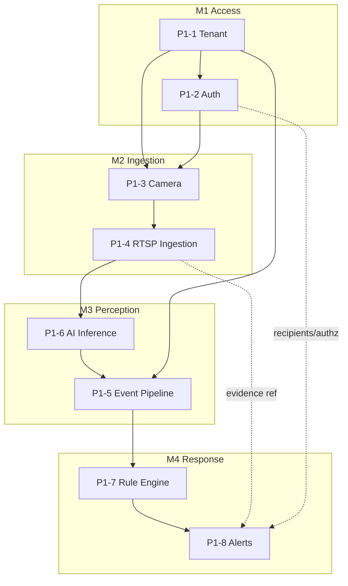

# Phase 1 — Implementation Roadmap

> Milestones → slices. One slice at a time; each ends production-ready with governance updated (per [DEVELOPMENT_RULES 18–25](../../ai/DEVELOPMENT_RULES.md)) and awaits Architect approval. **Design detail lives in the per-subsystem blueprints** (linked per slice) — this file is the plan: objective, dependencies, acceptance, status. Navigation + implementation-order rationale: [README](README.md).

Complexity scale: **S** (low risk) · **M** · **L** · **XL** (security-critical or new runtime). Live status per slice: [MASTER_PROGRESS](../../tracker/MASTER_PROGRESS.md).

## Milestones

| #      | Milestone                      | Slices     | Exit criterion                                                                                                          |
| ------ | ------------------------------ | ---------- | ----------------------------------------------------------------------------------------------------------------------- |
| **M1** | Multi-Tenant Access Foundation | P1-1, P1-2 | A user authenticates; every request carries a validated, isolated `TenantContext`; refresh-reuse revokes lineage.       |
| **M2** | Camera & Media Ingestion       | P1-3, P1-4 | A tenant onboards a camera; its stream connects, decodes to frames, records to tenant-scoped storage; loss reconnects.  |
| **M3** | Perception & Event Backbone    | P1-6, P1-5 | A frame → a detection → a persisted, deduplicated `EventEnvelope`; `event.persisted` published.                         |
| **M4** | Automation & Response          | P1-7, P1-8 | An event matches a rule, raises an incident, delivers an alert on one channel with ack — **end-to-end vertical works**. |

A milestone is **Done** only when all its slices are Done ([canonical per-slice DoD](../../project/DEFINITION_OF_DONE.md)) **and** its exit criterion passes with CI green (build/test/lint/scan/import-graph/contracts + isolation).

## Sequencing & parallelization

**Runtime data path (must stay acyclic, [23-SERVICE-OWNERSHIP](../23-SERVICE-OWNERSHIP.md)):** `camera ▶ media ▶ inference ▶ events ▶ rules ▶ workflow ▶ notify`; `gateway ▶ (identity, tenant, camera)` control-plane reads point inward. `check:imports` enforces the code boundaries.

**Critical path:** P1-1 → P1-2 → P1-3 → P1-4 → P1-6 → P1-5 → P1-7 → P1-8. **Once P1-1 is merged**, these can proceed in parallel: `@vip/permissions` (P1-2 authz), the camera hierarchy model (P1-3), the RTSP test-source + decode spike (P1-4), the `inference` capability skeleton (P1-6), and downstream event/rule/alert **contracts** in `@vip/contracts`. **Serialized:** the live data path P1-4→P1-6→P1-5→P1-7→P1-8 (each consumes the previous stage's real output).

---

## M1 — Multi-Tenant Access Foundation

### P1-1 — Tenant foundation + fail-closed isolation · **L** · [TENANT_ARCHITECTURE](TENANT_ARCHITECTURE.md)

- **Objective:** Establish the tenant as the root of all data + a data-layer guard that makes cross-tenant access structurally impossible.
- **Dependencies:** Phase 0 (`@vip/contracts`, `@vip/config`, identity template, Mongo). None within Phase 1.
- **Acceptance:** every persisted record carries `tenantId`; a query without tenant context is rejected (fail-closed); the **cross-tenant isolation suite (baseline)** passes; `tenant` service exposes CRUD + `/health` `/ready` `/metrics`. Guard unit-tested; integration on Testcontainers Mongo.
- **Status:** 🟢 Code complete — ⏳ Architect review.

### P1-2 — Authentication & authorization · **L** · [AUTHENTICATION](AUTHENTICATION.md)

- **Objective:** Authenticate principals, mint the tenant context, authorize via RBAC/ABAC through the Policy Engine boundary.
- **Dependencies:** P1-1 (tenant context to mint).
- **Acceptance:** login issues access+refresh; refresh-reuse revokes the lineage; gateway rejects unauthenticated/expired; a permission check gates a protected route; context flows token → downstream; a user of tenant A cannot act on tenant B.
- **Status:** 🟢 Code complete — ⏳ Architect review.

## M2 — Camera & Media Ingestion

### P1-3 — Camera registry + org hierarchy · **M** · [CAMERA_ARCHITECTURE](CAMERA_ARCHITECTURE.md)

- **Objective:** Model the location hierarchy and onboard cameras with credentials encrypted at rest.
- **Dependencies:** P1-1 (tenant scoping), P1-2 (authz to manage cameras).
- **Acceptance:** a tenant creates a hierarchy and adds a camera; camera is tenant + zone scoped; `camera.registered` emitted; credentials never returned in plaintext; cameras never cross tenants (isolation test).
- **Status:** 🟢 Code complete — ⏳ Architect review. Credentials vaulted via **`@vip/crypto`** (AES-256-GCM); hierarchy stays Tenant-owned, camera references `zoneId` ([ED-0024](../../project/ENGINEERING_DECISION_LOG.md)).

### P1-4 — RTSP ingestion + recording · **L** · [INGESTION_PIPELINE](INGESTION_PIPELINE.md) · [STORAGE_ARCHITECTURE](STORAGE_ARCHITECTURE.md)

- **Objective:** Connect to a camera's RTSP stream, decode it, extract frames, and record to object storage.
- **Dependencies:** P1-3 (a camera to connect to), Storage. A local **RTSP test source** is added to the dev stack.
- **Acceptance:** the stream connects and frames are produced (H.264 first); a recording lands in MinIO under `{tenantId}/{cameraId}/…`; connection loss triggers reconnect + `media.stream.lost`; storage prefixes are tenant-isolated.
- **Status:** 🟢 Code complete — ⏳ Architect review. Storage isolation via **`@vip/storage`**; ffmpeg-binary decoder; creds resolved from camera's internal endpoint ([ED-0025](../../project/ENGINEERING_DECISION_LOG.md); perception handoff/shared-key [TD-4](../../../tracking/TECH-DEBT.md)).

## M3 — Perception & Event Backbone

### P1-6 — AI inference (capability runtime) · **XL** · [AI_PIPELINE](AI_PIPELINE.md)

- **Objective:** Run one model-agnostic capability over frames and produce detections.
- **Dependencies:** P1-4 (frames), Phase 0 MLOps registry (model artifact), `ai/mlops` config. Python runtime formalizes here.
- **Acceptance:** a frame in → a detection out (class + confidence + bbox) conforming to the capability contract; the capability self-describes; model is bound by **selector** (swap without code change). Start CPU/ONNX, one model, batch=1.
- **Status:** 🟢 Code complete — ⏳ Architect review. Manifest-driven **AI Runtime Platform** (`ai/inference`, Python): ModelAdapter seam, staged pipeline, lifecycle states, metrics, version metadata ([ED-0026](../../project/ENGINEERING_DECISION_LOG.md); real-ONNX/events [TD-5](../../../tracking/TECH-DEBT.md)).

### P1-5 — Event pipeline · **L** · [EVENT_PIPELINE](EVENT_PIPELINE.md)

- **Objective:** Turn capability outputs into normalized, correlated, deduplicated, persisted events on the backbone.
- **Dependencies:** P1-6 (produces outputs), P1-1 (tenant subjects/records), Phase 0 NATS + Mongo.
- **Acceptance:** a detection becomes a persisted `EventEnvelope` with `tenantId`; duplicates collapse (idempotent consumers); `event.persisted` published on `t.{tenantId}.event.*`; replay reproduces state; no cross-tenant subject/read.
- **Status:** ⬜ Not started.

## M4 — Automation & Response

### P1-7 — Rule engine · **L** · [RULE_ENGINE](RULE_ENGINE.md)

- **Objective:** Evaluate rules over events and raise incident candidates.
- **Dependencies:** P1-5 (events to evaluate), Redis (tenant-scoped rule state).
- **Acceptance:** a rule matches an event and emits `incident.candidate`; **dry-run** evaluates without side effects; rule changes are versioned + audited; evaluation is tenant-scoped; replay is deterministic. Rules stay distinct from policy ([ADR-0013](../../adr/ADR-0013-policy-engine.md)).
- **Status:** ⬜ Not started.

### P1-8 — Alert engine · **L** · [ALERT_ENGINE](ALERT_ENGINE.md)

- **Objective:** Turn incident candidates into managed incidents and deliver alerts.
- **Dependencies:** P1-7 (candidates), P1-4 (evidence refs), P1-2 (recipients + authz), Redis, an email/webhook provider.
- **Acceptance:** an `incident.candidate` becomes a raised incident; an alert is delivered on one channel with an ack path; channel failure → retry → dead-letter; state transitions persisted + tenant-scoped; the **full camera→alert vertical works end-to-end**.
- **Status:** ⬜ Not started.

---

## Phase 1 exit

All 8 slices Done; the **end-to-end vertical demo** passes; the **cross-tenant isolation suite** is green on every path; CI green; every slice has a scenario doc + review record ([REVIEW_HISTORY](../../tracker/REVIEW_HISTORY.md), Architect approval). A Phase 1 exit review then opens Phase 2. Full exit checklist: [README § Exit criteria](README.md#exit-criteria).
