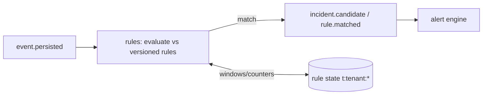

# Phase 1 — Rule Engine

> Grounds P1-7 in [10-RULE-ENGINE](../10-RULE-ENGINE.md), distinct from the Policy Engine ([28](../28-POLICY-ENGINE.md), [ADR-0013](../../adr/ADR-0013-policy-engine.md)). Rules = business logic over events; Policy = who/what/where/when governance.

## Purpose

Evaluate tenant-defined rules over the event stream and raise **incident candidates** — the automation brain that decides "this matters."

## Responsibilities

- Evaluate rules over `event.persisted` (+ correlated/aggregate events); versioning; **dry-run**; rule packs (interface).
- Maintain bounded, tenant-scoped rule state (Redis); deterministic re-evaluation via replay.
- Publish `incident.candidate`, `rule.matched`, `emit_event`.

## Components

| Component          | Role                                                    |
| ------------------ | ------------------------------------------------------- |
| `rules` service    | rule store, evaluator, dry-run, versioning              |
| Sandboxed DSL      | safe condition/aggregation language (no arbitrary code) |
| Rule state (Redis) | counters/windows, tenant-prefixed                       |

## Data flow

## APIs (Phase 1)

- `POST/GET/PATCH /rules` (tenant-scoped), `POST /rules/:id/dry-run`, `GET /rule-packs`.
- Consume: `event.persisted`. Publish: `incident.candidate`, `rule.matched`.

## Dependencies

P1-5 (events), P1-1 (tenant scoping), Redis (state), `@vip/contracts` (rule + incident schemas — added this slice).

## Failure handling

- DSL error / unsafe expression → rejected at author time (sandbox validation); never executes.
- Evaluation error at runtime → skip + metric; deterministic replay reconstructs state.
- State store loss → rebuild from event replay (bounded window).

## Scaling strategy

Partitioned by tenant/camera; stateful ops in Redis; horizontal consumers. Rule packs enable reuse across tenants without per-tenant code.

## Security considerations

- **Sandboxed DSL** (no arbitrary execution); tenant-scoped rules + state; rule changes versioned and audited; dry-run has no side effects.

## Future extension points

- Richer temporal/spatial operators, cross-camera correlation, ML-assisted thresholds, rule marketplace/packs per industry (Phase 3), integration with the Composition Layer ([24](../24-COMPOSITION-FRAMEWORK.md)).
