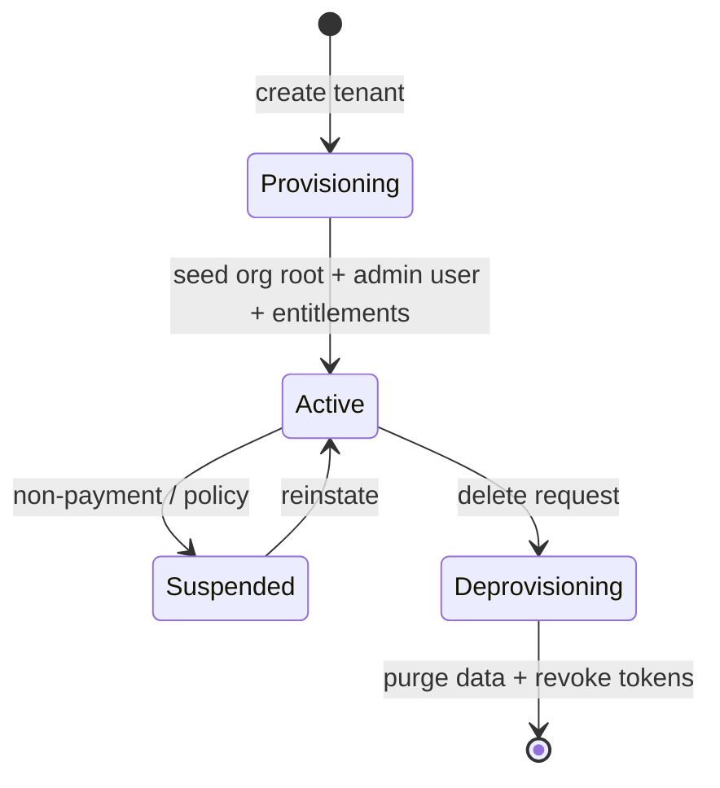
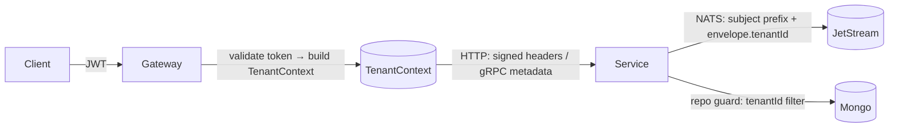

# Phase 1 — Multi-Tenant Architecture

> The security foundation of the platform. Grounds Phase 1 in [06-MULTI-TENANT-SAAS](../06-MULTI-TENANT-SAAS.md), [15-SECURITY](../15-SECURITY-ARCHITECTURE.md), [18-DATA-ARCHITECTURE](../18-DATA-ARCHITECTURE.md), [28-POLICY-ENGINE](../28-POLICY-ENGINE.md). **Law 5: every operation is tenant-scoped and fail-closed.**

## Principle

**No operation runs without a resolved, validated `TenantContext`.** On any doubt, deny. Isolation is enforced structurally (a data-layer guard), not by convention — so a forgotten `where tenantId` cannot leak data.

## 1. Tenant lifecycle

- **Provision:** `tenant` service creates the tenant, its org-hierarchy root, an initial admin principal, and default config; emits `tenant.created`. Other services react (identity seeds the admin; camera/events prepare tenant scoping).
- **Active:** normal operation.
- **Suspend/Reinstate:** access denied at the gateway while data is retained.
- **Deprovision:** data purged per tenant prefix, tokens revoked, events tombstoned.

## 2. Tenant context propagation

`TenantContext` ([contract](../../../packages/contracts/src/common/tenant-context.ts)): `{ tenantId, principalId, roles, permissions, scopes, branchId?, siteId?, zoneId?, cameraId? }`.

- **Ingress:** the `gateway` validates the JWT, resolves `TenantContext`, and attaches it (signed internal headers / gRPC metadata). Downstream services never re-derive trust from the client.
- **In-process:** carried explicitly (not a global); passed to the repository guard and event publisher.
- **Async:** every event's `EventEnvelope.tenantId` + a tenant-scoped NATS subject (`t.{tenantId}.…`) carry the tenant across hops.
- **Correlation:** the Phase 0 correlation id rides alongside for tracing.

## 3. Authentication

See [AUTHENTICATION](AUTHENTICATION.md). Summary: OIDC/JWT (access + refresh with reuse-detection), MFA-ready; the gateway is the single validation point; identity mints the context from tenant + principal.

## 4. Authorization

- **RBAC:** roles → permission sets (`resource:action[:scope]`).
- **ABAC:** scopes (`own|zone|site|branch|region|tenant|global`) constrain a permission to a subtree of the hierarchy.
- **Policy boundary:** checks go through `@vip/permissions` as a Policy Decision Point ([28-POLICY-ENGINE](../28-POLICY-ENGINE.md)); Phase 1 implements RBAC+scope, leaving the full policy engine for Phase 3.

## 5. Tenant isolation

**Strategy: pooled-by-default, siloed-optional** ([ADR-0003](../../adr/ADR-0003-tenant-isolation-strategy.md)). Phase 1 implements pooled with a hard guard:

- **`@vip/tenancy` data guard:** all repositories go through a base that (a) requires a `TenantContext`, (b) injects `tenantId` into every read/write filter, (c) rejects any query lacking it (fail-closed). No service writes ad-hoc Mongo queries.
- **Enforcement, not trust:** the isolation test suite (P1 exit gate) asserts, on every endpoint and event subject, that tenant A cannot read/write/observe tenant B.

## 6. Database strategy (MongoDB)

- Pooled DB; **every collection document carries `tenantId`** (indexed; compound indexes lead with `tenantId`).
- The guard enforces `tenantId` on all queries; aggregation pipelines are wrapped to inject a leading `$match: { tenantId }`.
- Siloed option (dedicated DB per enterprise tenant) is a later config switch — the guard abstracts the connection so app code is unchanged.
- Details: [STORAGE_ARCHITECTURE](STORAGE_ARCHITECTURE.md), [18-DATA-ARCHITECTURE](../18-DATA-ARCHITECTURE.md).

## 7. Redis strategy

- **Key namespacing:** every key is prefixed `t:{tenantId}:…` (sessions, rate limits, rule state, caches). A thin Redis client wrapper enforces the prefix so raw keys can't collide across tenants.
- Rate limiting + entitlement/feature caches are per-tenant. Optional per-tenant logical DB for large enterprise tenants later.

## 8. Object storage strategy (MinIO/S3)

- **Prefix isolation:** all objects under `{tenantId}/{cameraId}/{eventId}…`; access via short-lived signed URLs scoped to the prefix.
- Recordings/evidence never cross prefixes; the storage client wrapper requires a `TenantContext` to resolve a key. See [STORAGE_ARCHITECTURE](STORAGE_ARCHITECTURE.md).

## 9. Background worker strategy

- Workers (media, inference, events, rules) **carry the tenant context in the job/message**, never assume a global tenant.
- Queues/subjects are tenant-scoped; consumers apply the same repo/storage guards. A worker with no tenant context on a job **drops it, fail-closed**, and alerts.

## 10. AI inference isolation

- The `inference` capability is **stateless per request**; the frame + its `TenantContext` travel together. No cross-tenant batching in Phase 1 (batch within a tenant only).
- Model artifacts are shared (multi-tenant, bound by selector); **tenant data (frames/embeddings) is never persisted by the capability** — outputs flow back as tenant-tagged events. Re-ID/embedding stores (later) are per-tenant namespaces.

## 11. Event isolation

- **Subjects:** `t.{tenantId}.<domain>.<event>` on JetStream; consumers subscribe within a tenant scope. A cross-tenant subscription is a boundary violation caught in review + isolation tests.
- **Envelope:** `EventEnvelope.tenantId` is mandatory and validated on ingest; an event without it is rejected to a dead-letter, not processed.

## 12. Future scaling

- **Pooled → siloed** per enterprise tenant (dedicated DB/namespace) via config, no app rewrite.
- **Regional data planes** ([27-CONTROL-DATA-PLANE](../27-CONTROL-DATA-PLANE.md)) keep a tenant's video/events in-region; the guard + prefixing already localize data.
- Per-tenant sharding of hot stores (event/rule state) by `tenantId`.

## 13. Failure scenarios

| Scenario                                       | Behaviour (fail-closed)                       |
| ---------------------------------------------- | --------------------------------------------- |
| Request with no/invalid token                  | Gateway rejects (401); no context created     |
| Valid token, missing tenant context downstream | Service rejects (403); nothing read           |
| Query reaches the repo without `TenantContext` | Guard throws; request fails; alert            |
| Event/job missing `tenantId`                   | Dead-lettered; never processed                |
| Tenant suspended                               | Gateway denies; data retained                 |
| Guard bug / regression                         | Isolation test suite fails CI → merge blocked |

## 14. Security considerations

- Fail-closed everywhere; deny-by-default authorization.
- Credentials (camera, etc.) encrypted at rest at the app layer (`.env`-provided keys, [ADR-0018](../../adr/ADR-0018-env-only-secrets-and-centralized-config.md)); no plaintext in responses/logs.
- No PII in logs; correlation ids only. Per-tenant KMS envelope encryption for evidence is a Phase 3 hardening ([15 §4](../15-SECURITY-ARCHITECTURE.md)); Phase 1 uses app-layer encryption + prefix isolation.
- The **cross-tenant isolation test suite is a standing CI gate** from P1-1 onward.

## Extension points

- Swap pooled→siloed per tenant (connection resolver).
- Plug the full Policy Engine (PDP) behind `@vip/permissions` without changing call sites.
- Regional routing at the gateway/control plane.
