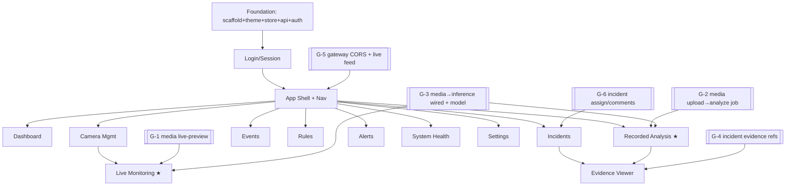

# P2-1 — Operations Console: Implementation Plan

_Status: ⏳ Architect Review Pending · Author: Claude · Date: 2026-07-29_

> The build plan for the SOC Operations Console — the productization milestone that turns the Phase-1
> platform into a demonstrable product. **Planning only; no implementation until Architect approval**
> ([ED-0030](../../project/ENGINEERING_DECISION_LOG.md)). Companion docs:
> [DESIGN_SYSTEM](DESIGN_SYSTEM.md) · [PHASE1_EXIT_REVIEW](../../project/PHASE1_EXIT_REVIEW.md).
> Contains the ten required artifacts (UI architecture, routes, component hierarchy, design system,
> navigation, layout, folders, Tailwind org, reusable components, page dependency diagram) plus the
> state strategy, API mapping, backend-enabler mapping, and milestone breakdown.

## 0. Stack (Architect-mandated — decided, not proposed)

| Concern                        | Choice                                                                                |
| ------------------------------ | ------------------------------------------------------------------------------------- |
| Framework / language / bundler | **React 19 · TypeScript · Vite**                                                      |
| Styling                        | **Tailwind CSS v4** (+ **Tailwind MCP** for tokens/utilities/a11y)                    |
| Components                     | **shadcn/ui** (Radix under the hood)                                                  |
| Client/UI state                | **Redux Toolkit** (slices + listener middleware)                                      |
| Server state                   | **TanStack Query** (fetch/cache/mutations)                                            |
| Routing                        | **React Router** (v6/v7 data router)                                                  |
| Icons                          | **Lucide** · Charts: **Recharts** · Forms: **React Hook Form + Zod**                  |
| Types                          | **`@vip/contracts`** imported **for types only** (one source of truth for API shapes) |

**Placement:** new `apps/console` workspace package under a new `apps/*` glob. A new import-graph
**`app` layer** may import shared (`packages/*`) but **never** services or plugins; nothing imports an
app. This boundary + the stack land via **ED-0030 / ADR-0019** (the one architecture change this
milestone needs, hence the review gate).

---

## 1. UI Architecture

A single-page app behind the gateway, layered like the services (transport → application → domain):

```
┌─────────────────────────────────────────────────────────────┐
│ AppShell (Topbar + Sidebar + <Outlet/>)                     │  layout
├─────────────────────────────────────────────────────────────┤
│ Pages (route components)  — orchestrate, no fetching logic  │  routes
├─────────────────────────────────────────────────────────────┤
│ Feature modules (camera/live/incidents/…)                   │  features
│   • hooks: useIncidents(), useCameras(), useAnalyzeJob()…   │  ← TanStack Query lives here
│   • components: IncidentTable, CameraGrid, EvidenceViewer…  │
├─────────────────────────────────────────────────────────────┤
│ Primitives + SOC composites (design system)                 │  ui
├─────────────────────────────────────────────────────────────┤
│ lib: api client, auth, query keys, rtk store, ws/sse feed   │  infra
└─────────────────────────────────────────────────────────────┘
```

**Principles.** Feature-sliced (each page/feature is self-contained + independently testable);
data access **only** through typed hooks (never `fetch` in a component); presentational primitives are
pure + token-driven; the app is a **thin client of the gateway** — all business logic stays server-side.

## 2. Route Structure (React Router data router)

```
/login                         → LoginPage                       (public)
/                              → AppShell (auth guard)
  ├─ /                         → DashboardPage
  ├─ /cameras                  → CameraListPage
  │    └─ /cameras/:id         → CameraDetailPage
  ├─ /live                     → LiveMonitoringPage      (flagship)
  ├─ /analyze                  → RecordedAnalysisPage
  │    └─ /analyze/:jobId      → AnalysisJobPage (timeline→events→incidents→alerts→evidence)
  ├─ /events                   → EventsPage (timeline + filters + search)
  ├─ /rules                    → RulesListPage
  │    ├─ /rules/new           → RuleEditorPage
  │    └─ /rules/:id           → RuleEditorPage (+ dry-run, version history)
  ├─ /incidents                → IncidentsPage
  │    └─ /incidents/:id       → IncidentDetailDrawer (ack/assign/resolve/close/comments/evidence)
  ├─ /alerts                   → AlertsPage (delivery history, ack, retry state)
  ├─ /evidence/:incidentId     → EvidenceViewerPage (snapshot/clip/timeline/rule/camera/confidence/corrId)
  ├─ /health                   → SystemHealthPage (service + runtime + camera health)
  └─ /settings                 → SettingsPage
       ├─ /settings/org        → Organizations + Sites (tenant/org-nodes)
       ├─ /settings/users      → Users + Roles + Permissions
       └─ /settings/profile    → Session + preferences
/design  (dev only)            → DesignSystemGallery (every primitive + state)
```

Filters/search/time-range live in **URL query params** (shareable, bookmarkable, restore-on-reload).

## 3. Component Hierarchy (representative)

```
<App> (Providers: Redux, QueryClient, Router, Theme, Toaster)
 └─ <AppShell>
     ├─ <Topbar> (TenantSwitcher, GlobalSearch, LiveClock, ConnectionState, UserMenu)
     ├─ <Sidebar> (NavItem×N, collapse toggle)  ← Navigation §5
     └─ <Outlet>
         ├─ <DashboardPage>
         │   └─ MetricCard×4 · ActiveIncidentsPanel(IncidentCard*) · CameraHealthPanel(StatusIndicator*)
         │       · RuntimeHealthPanel · RecentDetectionsTable · SystemStatusPanel
         ├─ <LiveMonitoringPage>
         │   └─ <ResizablePanels> → <CameraGrid> → CameraTile*( <VideoPlayerContainer> + <DetectionOverlay>
         │                                          + StatusIndicator + FPS/Latency readout )
         │       └─ <IncidentTicker> (aria-live) · <RuntimeStatusBar>
         ├─ <RecordedAnalysisPage>
         │   └─ <UploadDropzone> → <AnalysisProgress> → <AnalysisTimeline>
         │       → EventsList → IncidentsList → AlertsList → <EvidenceStrip>(clip thumbs)
         ├─ <IncidentsPage>
         │   └─ <FilterBar> · <IncidentTable>(SeverityBadge, StatusBadge) · <IncidentDetailDrawer>
         │       (Timeline, EvidenceViewer, Comments, ack/assign/resolve/close)
         └─ … (Events / Rules / Alerts / Evidence / Health / Settings analogous)
```

## 4. Design System

Full spec in **[DESIGN_SYSTEM](DESIGN_SYSTEM.md)** — dark-first tokens (oklch palette, severity/status
colours, type/spacing/radius/elevation/motion scales, widescreen breakpoints), shadcn/ui theming, and
the SOC composite primitives (CameraTile, IncidentCard, Timeline, VideoPlayerContainer, MetricCard,
StatusIndicator, EmptyState, LoadingSkeleton, …). **Design-system-first: primitives are built and
gallery-verified before any page.**

## 5. Navigation Structure

Primary **collapsible left icon-rail** (Lucide icons + labels), grouped by operator workflow:

```
MONITOR      Dashboard · Live Monitoring · Cameras
INVESTIGATE  Events · Incidents · Alerts · Evidence
CONFIGURE    Rules · Settings (Org/Users/Roles)
SYSTEM       System Health
```

Nav items are **permission-gated** (deny-by-default) — an operator without `rule:create` never sees the
Rules editor action; a viewer sees read-only surfaces. Topbar carries tenant context, global search,
a live clock, backbone/connection state, and the user menu (profile, logout).

## 6. Layout Strategy

- **Desktop/widescreen primary.** App shell = fixed Topbar (56px) + collapsible Sidebar (64px rail ↔
  240px) + fluid content. Content max-width unbounded on `3xl+` (use the wall).
- **Live Monitoring** uses `react-resizable-panels` for operator-arranged layouts; camera grid columns
  scale by breakpoint (2→3→4→6) — **4K adds tiles, not size** (situational awareness).
- **Density-aware** tables/lists (compact default for operators). Sticky headers + virtualized rows
  (TanStack Virtual) for large event/incident lists.
- Detail views are **right-side drawers** (keep context) except full-screen Evidence/Analysis.
- Mobile: responsive collapse to a single column + drawer nav (secondary priority).

## 7. Folder Structure (`apps/console`)

```
apps/console/
  index.html · vite.config.ts · tsconfig.json · package.json
  src/
    main.tsx · App.tsx
    app/
      store.ts                 # RTK store + listener middleware
      queryClient.ts           # TanStack Query config
      router.tsx               # route tree
      providers.tsx            # Redux/Query/Theme/Router/Toaster
      styles/theme.css         # the @theme tokens (design system §7)
    lib/
      api/                     # typed gateway client (fetch wrapper, per-service modules)
      auth/                    # session, token refresh, route guards
      realtime/                # SSE/poll live feed → RTK slice
      queryKeys.ts · cn.ts · format.ts (time-ago, correlationId, fps)
    store/                     # RTK slices: session, ui, live, filters
    ui/                        # design-system primitives + shadcn components + composites
    features/
      auth/ dashboard/ cameras/ live/ analyze/ events/ rules/ incidents/ alerts/ evidence/ health/ settings/
        # each: components/ · hooks/ (Query) · <Feature>Page.tsx · __tests__/
    test/                      # setup, MSW handlers, test utils
```

## 8. Tailwind Organization Strategy

Per [DESIGN_SYSTEM §7](DESIGN_SYSTEM.md): one `@theme` token block; repeated utility chains promoted to
`@utility`/cva variants (Tailwind MCP detects duplication); `cn()` for merges; **no inline hex/px**
(ESLint-enforced); dark-first with a variable-swap light theme reserved. The **Tailwind MCP** is run as
part of the design-system slice and on each page to consolidate utilities, validate spacing/contrast,
and recommend responsive/a11y patterns.

## 9. Reusable Components List

Primitives + SOC composites are enumerated with variants in [DESIGN_SYSTEM §6](DESIGN_SYSTEM.md):
Button, Card, Panel/Section, Table, Badge, Alert, Dialog, Drawer, Sidebar, Navbar, Tabs/Inputs/Select/
Switch/Tooltip/DropdownMenu/Skeleton/Toast (shadcn, themed) + **StatusIndicator, SeverityBadge,
MetricCard, CameraTile, IncidentCard, NotificationCard, Timeline, VideoPlayerContainer,
DetectionOverlay, EmptyState, LoadingSkeleton, PageHeader, FilterBar** (custom). **Every page composes
these; no page ships bespoke styling.**

## 10. Page Dependency Diagram



★ = flagship / primary demo screen. `[[G-n]]` = backend enabler from the Exit Review §11.

## 11. State Management Strategy (RTK + TanStack Query division of labour)

**Two stores, clear ownership — no overlap:**

- **TanStack Query = server state** (everything fetched from the gateway): incidents, cameras, events,
  rules, notifications, analysis jobs. Owns caching, background refetch, pagination (cursor), and
  **mutations** (ack/resolve/close, rule CRUD, channel CRUD, upload) with optimistic updates +
  invalidation. Query keys centralised in `lib/queryKeys.ts`. **RTK Query is NOT used** (TanStack Query
  is the mandated data layer).
- **Redux Toolkit = global client state** (synchronous, app-wide, non-server): `session` (current user,
  tenant, permissions, token lifecycle), `ui` (theme, sidebar collapsed, table density, live-grid
  layout), `filters` (shared cross-page filter defaults), and `live` (a bounded buffer of incoming
  incidents/alerts fed by the realtime slice). **Listener middleware** drives the SSE/poll feed and
  cross-cutting reactions (e.g. toast on a new critical incident).
- **URL (React Router) = view state**: filters, search, time-range, selected tab — so views are
  shareable and reload-safe.
- **Realtime**: `lib/realtime` subscribes to the gateway live feed (SSE first; polling fallback until
  G-5 lands) and dispatches into the `live` slice + invalidates affected Query keys.

## 12. API Mapping (console → gateway `/api/:service/*`)

| Console module    | Method · Endpoint (through gateway)                                                     | Backend                | Notes                                    |
| ----------------- | --------------------------------------------------------------------------------------- | ---------------------- | ---------------------------------------- |
| Auth              | `POST /api/identity/auth/login\|refresh\|logout` · `GET /auth/me`                       | identity               | token in memory; silent refresh          |
| Dashboard         | aggregates of the below + `GET /api/*/health`                                           | all                    | poll → SSE (G-5)                         |
| Camera Mgmt       | `GET/POST /api/camera/cameras` (+ `:id`, health)                                        | camera                 | test-connection + live-preview = **G-1** |
| Live Monitoring   | `GET /api/media/streams` (+status); **live frames = G-1**; overlays = **G-3**           | media, inference       | flagship                                 |
| Recorded Analysis | **upload+job = G-2**; job status/results; then events/incidents/alerts below            | media→inference→events | mandatory                                |
| Events            | `GET /api/events/events` (cursor, filters)                                              | events                 | timeline/search/severity                 |
| Rules             | `GET/POST/PATCH/DELETE /api/rules/rules` · `/:id/dry-run` · `/:id/versions`             | rules                  | full CRUD                                |
| Incidents         | `GET /api/workflow/incidents` · `/:id/(ack\|resolve\|close)`; **assign/comments = G-6** | workflow               |                                          |
| Alerts            | `GET /api/notify/notifications` · `/:id/ack` · `/notification-channels`                 | notify                 | delivery/retry state                     |
| Evidence          | incident `evidence` refs (**G-4**) → media snapshot/clip signed URLs                    | workflow, media        | strongest screen                         |
| System Health     | `GET /api/:service/health\|ready\|metrics`                                              | all + inference        |                                          |
| Settings          | `/api/tenant/tenants`·`/org-nodes` · `/api/identity/users` · roles (static model)       | tenant, identity       |                                          |

## 13. Backend enablers (service EXTENSIONS — reviewed separately, no new services)

Per the Exit Review §11, six thin backend extensions gate the "product" criteria. Each is its own
reviewed increment, sequenced **before** the console module that needs it:

| ID  | Extension                                                   | Service(s)       | Unblocks           | Debt       |
| --- | ----------------------------------------------------------- | ---------------- | ------------------ | ---------- |
| G-1 | MJPEG/snapshot live-preview + camera test-connection        | media, camera    | Live, Camera Mgmt  | new        |
| G-2 | File-source upload → ffmpeg decode → analyze job + status   | media            | Recorded Analysis  | TD-4       |
| G-3 | Wire media→inference frame bus + register one ONNX model    | media, inference | Live, Analysis     | TD-4, TD-5 |
| G-4 | Incident evidence refs (snapshot/clip signed URLs on raise) | workflow, media  | Evidence Viewer    | TD-8       |
| G-5 | Gateway CORS + SSE live feed                                | gateway          | all (live updates) | new        |
| G-6 | Incident assign + comments fields/routes                    | workflow         | Incidents          | TD-8       |

**These are not new platform services** — they extend media/workflow/gateway/inference within the frozen
boundaries. They must be approved with the same review discipline.

## 14. Milestone breakdown (incremental; each independently testable)

Follows the Architect's recommended order. Each sub-slice ships with Vitest + React Testing Library +
MSW-mocked API tests and a route smoke; backend enablers interleave before their consumer.

| Slice       | Deliverable                                                                                                                                                                                      | Depends on               |
| ----------- | ------------------------------------------------------------------------------------------------------------------------------------------------------------------------------------------------ | ------------------------ |
| **P2-1.0**  | Foundation: `apps/console` scaffold, Tailwind v4 + `@theme` tokens, shadcn/ui, RTK store, Query client, Router, typed gateway API client, **`apps/*` glob + `app` import-graph layer (ED-0030)** | ED-0030 approved         |
| **P2-1.1**  | **Design System**: primitives + SOC composites + `/design` gallery (Tailwind MCP)                                                                                                                | P2-1.0                   |
| **P2-1.2**  | **Authentication**: login/logout, session, silent refresh, route guards, permission gating                                                                                                       | P2-1.1                   |
| **P2-1.3**  | **App Layout & Navigation**: AppShell, Sidebar/Topbar, theme, tenant switch                                                                                                                      | P2-1.2                   |
| **P2-1.4**  | **Dashboard shell**: metric cards, active incidents/alerts, camera+runtime health, recent detections (poll)                                                                                      | P2-1.3                   |
| **P2-1.5**  | **Camera Management**: list, register RTSP, test-connection, health, stream status                                                                                                               | P2-1.4, **G-1**          |
| **P2-1.6**  | **Live Monitoring ★**: camera grid, resizable panels, MJPEG preview, detection overlays, FPS/latency/runtime                                                                                     | P2-1.5, **G-1, G-3**     |
| **P2-1.7**  | **Recorded Video Analysis ★**: upload→progress→timeline→events→incidents→alerts→evidence                                                                                                         | P2-1.4, **G-2, G-3**     |
| **P2-1.8**  | **Events**: timeline, filters, search, severity, detail                                                                                                                                          | P2-1.4                   |
| **P2-1.9**  | **Rules**: list/create/edit/enable/disable/dry-run/version history                                                                                                                               | P2-1.4                   |
| **P2-1.10** | **Incidents**: timeline, status, ack/assign/resolve/close, comments, detail drawer                                                                                                               | P2-1.4, **G-6**          |
| **P2-1.11** | **Alerts**: notification history, delivery status, ack, retry state                                                                                                                              | P2-1.4                   |
| **P2-1.12** | **Evidence Viewer**: snapshot/clip, event timeline, rule, camera, confidence, correlation id                                                                                                     | P2-1.10, P2-1.7, **G-4** |
| **P2-1.13** | **System Health + Settings**: service/runtime/camera health; org/users/roles/profile                                                                                                             | P2-1.3                   |
| **P2-1.14** | **Demo hardening**: one-command stack + seed fixture; end-to-end walkthrough of the 10 success criteria                                                                                          | all + G-5                |

## 15. Testing & quality gates (frontend)

- **Unit/component**: Vitest + React Testing Library; **MSW** mocks the gateway (contract-shaped via
  `@vip/contracts`). Each feature ships tests for its hooks + key components + a page smoke.
- **Type-safety**: `tsc` strict; API types derived from `@vip/contracts` (no drift).
- **Lint/format**: ESLint (incl. the no-inline-hex/px rule) + Prettier, wired into the root gate.
- **a11y**: contrast (Tailwind MCP) + keyboard/focus checks on primitives.
- **CI**: a `console` job (typecheck/lint/test/build) added to the pipeline. Playwright E2E of the
  success-criteria walkthrough is a stretch goal for P2-1.14.
- **Import-graph**: the new `app` layer is enforced (app→shared only; never services/plugins).

## 16. Non-goals (deferred, per directive)

Billing · reports · customer analytics · AI behaviour packs · face recognition · retail/shoplifting/
cashier intelligence · email/SMS providers. Light theme, WebRTC/HLS live (MJPEG first), and Playwright
E2E depth are post-P2-1.

## 17. Definition of Done (P2-1)

The 10 success criteria demonstrable end-to-end: login → register RTSP camera → live video → upload a
recorded video → analyze → events → incidents → alerts → review evidence → full customer walkthrough —
on the one-command demo stack, with the design system reused throughout, permission-gated, tenant-scoped.

## 18. Open questions for the Architect (review gate)

1. **ED-0030 / ADR-0019** — approve the `apps/*` workspace layer + `app` import boundary + the mandated
   stack? (Required before P2-1.0.)
2. **Backend enablers G-1…G-6** — approve as reviewed service **extensions** (not new services), and
   confirm sequencing ahead of their consumer modules?
3. **Live-view transport** — MJPEG/snapshot for P2-1 (WebRTC/HLS later): acceptable?
4. **Live feed** — SSE via the gateway (G-5), with polling until it lands: acceptable?
5. **Real model** — register one ONNX detector on dev-stack MLflow (TD-5) for a credible demo?

> On approval, implementation proceeds slice-by-slice (P2-1.0 → …), maintaining Documentation,
> Component docs, Design decisions, Review History, and Quality Gates, and leaving the milestone in
> **Architect Review Pending** until complete.
