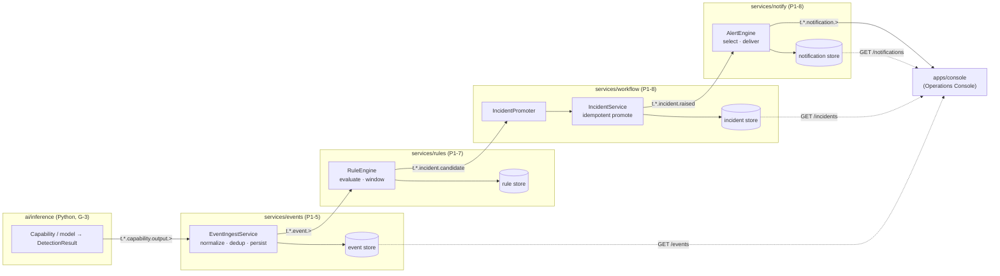
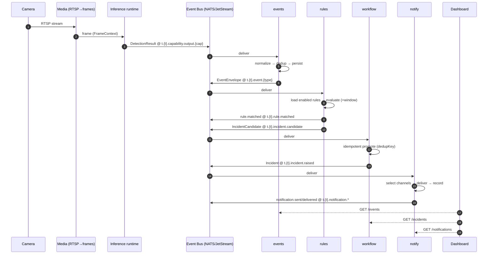
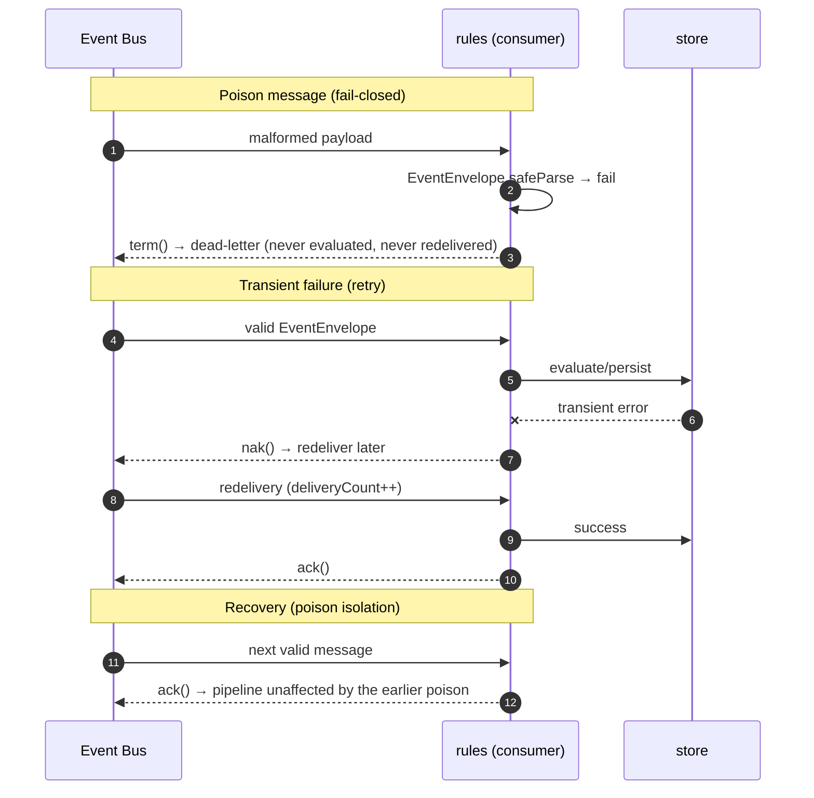

# G-3.5 — End-to-End Pipeline Validation

> **Milestone:** P2-2 **G-3.5** (between G-3 Inference and G-4 Evidence APIs) · **Type:** validation only — **no new production features** · **Status:** ✅ code + tests complete · ⏳ **Architect review pending**
> **Objective:** prove the complete Vision Intelligence Platform backend operates correctly, deterministically, securely, and is ready for **G-4 Evidence APIs**.
> **Author:** Claude · _2026-07-30_

---

## 0. Verdict at a glance

| Requirement (Architect)              | Where proven                                                                                                                                       | Result                                     |
| ------------------------------------ | -------------------------------------------------------------------------------------------------------------------------------------------------- | ------------------------------------------ |
| Full pipeline Camera→…→Dashboard     | [`traceability.e2e.test.ts`](../../tools/e2e/test/traceability.e2e.test.ts), [`scenarios.e2e.test.ts`](../../tools/e2e/test/scenarios.e2e.test.ts) | ✅                                         |
| #1 End-to-end traceability           | traceability suite                                                                                                                                 | ✅ id chain Event→Candidate→Incident→Alert |
| #2 correlationId propagation         | traceability suite                                                                                                                                 | ✅ identical across the spine              |
| #3 Event replay / determinism        | [`rules-behaviour.e2e.test.ts`](../../tools/e2e/test/rules-behaviour.e2e.test.ts)                                                                  | ✅ identical evaluations on replay         |
| #4 Multi-tenant isolation            | [`multi-tenant.e2e.test.ts`](../../tools/e2e/test/multi-tenant.e2e.test.ts)                                                                        | ✅ A never produces B artifacts            |
| #5 Rule conflict                     | rules-behaviour suite                                                                                                                              | ✅ N rules → N incidents                   |
| #6 Duplicate events                  | rules-behaviour suite                                                                                                                              | ✅ collapsed (ingest + candidate dedup)    |
| #7 Performance baseline              | [`performance.e2e.test.ts`](../../tools/e2e/test/performance.e2e.test.ts)                                                                          | ✅ 100/1k/10k measured                     |
| #8 Deterministic AI scenarios (9)    | [`src/scenarios.ts`](../../tools/e2e/src/scenarios.ts) + scenarios suite                                                                           | ✅ all 9 green                             |
| #9 Sequence + failure/retry/recovery | this report §4, [`failure-recovery.e2e.test.ts`](../../tools/e2e/test/failure-recovery.e2e.test.ts)                                                | ✅                                         |
| #10 Deliverables package             | this report + [`tools/e2e`](../../tools/e2e/)                                                                                                      | ✅                                         |

**Automated tests:** `@vip/e2e` — **7 files, 33 tests, deterministic, no camera / Mongo / NATS.**

---

## 1. Scope & method

G-3.5 validates the **assembled backend**, not a new feature. It introduces one workspace package,
[`tools/e2e`](../../tools/e2e/) (`@vip/e2e`), which composes the **real application classes** of the
four spine services onto a single broker-free bus and drives them deterministically.

- **In-process, no infrastructure.** The [`InMemoryEventBus`](../../packages/messaging/src/event-bus.ts)
  delivers synchronously and recursively, so one `emitDetection()` cascades through the entire chain
  within a single awaited call — no sleeps, no polling, no flakiness.
- **Deterministic.** Every service component is injected with a fixed [`Clock`](../../tools/e2e/src/determinism.ts)
  and a sequential UUID factory; nothing calls `Date.now()` or `crypto.randomUUID()`. Same inputs ⇒
  byte-identical outputs (the basis of replay + regression).
- **Real code, not mocks.** The harness imports `EventIngestService`, `RuleEngine`, `IncidentPromoter`
  - `IncidentService`, and `AlertEngine` verbatim from `services/*` and wires them exactly as each
    service's `src/index.ts` composition root does. It only substitutes the **in-memory adapters** the
    services already ship for tests, and the in-memory bus for NATS.
- **Boundary-legal.** `tools/*` is outside the runtime dependency graph
  ([check-imports.mjs](../../tools/import-graph/check-imports.mjs) skips the `tool` layer), so the
  harness may compose multiple services **for validation** without violating `noCrossServiceInternals`
  — production code still never imports across services; they talk over the bus alone.

### Entry points

| Door                                                                            | Used by                                                  | Path exercised                                                                  |
| ------------------------------------------------------------------------------- | -------------------------------------------------------- | ------------------------------------------------------------------------------- |
| **Inference** — publish a `DetectionResult` on `t.{tenant}.capability.output.*` | person / fire / smoke                                    | events-service **normalize → persist → publish** → rules → workflow → notify    |
| **Producer** — emit a semantic `EventEnvelope` on `t.{tenant}.event.*`          | camera-offline / fight / queue / ppe / loitering / theft | events **persist (dashboard read-model) → publish** → rules → workflow → notify |

The producer door models a boundary that is **not yet wired in the Node backbone** (see **TD-1/TD-2**):
the Python inference runtime's `events.py` already produces these semantic envelopes; the Node
`event-normalizer` only maps person/vehicle/fire/smoke labels today.

---

## 2. Backend spine — component map



Streams (JetStream, [subjects.ts](../../packages/messaging/src/subjects.ts)): `CAPABILITY_OUTPUT` →
`EVENTS` → `AUTOMATION` (candidate + incident lifecycle) → `NOTIFICATIONS`. Each consumer filters
**only** the subject it owns and publishes onto a **different** root, so the graph is acyclic by
construction (no consumer can trigger on its own output).

---

## 3. Deterministic AI scenario catalog (req #8)

Nine reusable scenarios ([`src/scenarios.ts`](../../tools/e2e/src/scenarios.ts)) — each is both a
regression test and a future customer demo. All drive Inference/Producer → Event → Rule → Incident →
Alert → Dashboard.

| Scenario                | Entry     | Event type                    | Category   | Rule → severity               | Result |
| ----------------------- | --------- | ----------------------------- | ---------- | ----------------------------- | ------ |
| Person at entrance      | inference | `perception.person.detected`  | perception | conf ≥ 0.7 → medium           | ✅     |
| Fire in warehouse       | inference | `perception.fire.detected`    | safety     | any → **critical**            | ✅     |
| Smoke in server room    | inference | `perception.smoke.detected`   | safety     | any → high                    | ✅     |
| Camera offline          | producer  | `system.camera.disconnected`  | system     | any → high                    | ✅     |
| Fight detected          | producer  | `behavior.fight.detected`     | security   | any → high                    | ✅     |
| Queue exceeds threshold | producer  | `analytics.queue.length`      | analytics  | `payload.count ≥ 10` → medium | ✅     |
| PPE violation           | producer  | `safety.ppe.violation`        | safety     | any → high                    | ✅     |
| Loitering               | producer  | `behavior.loitering.detected` | security   | any → medium                  | ✅     |
| Theft suspected         | producer  | `behavior.theft.suspected`    | security   | any → high                    | ✅     |

Each scenario asserts: the persisted envelope re-parses against the `EventEnvelope` contract, the
canonical type + category are correct, exactly one incident at the expected severity is raised, one
notification is delivered, and the **strict boundary** holds — the runtime never emits `incident.*`;
every incident is produced by workflow **after** a rule candidate.

---

## 4. Sequence diagrams (req #9)

### 4.1 Happy path — perception detection to alert



### 4.2 Failure / retry / recovery



**Retry semantics** ([event-bus.ts](../../packages/messaging/src/event-bus.ts)): consumers `ack`
success, `nak` transient failures (bus redelivers, `maxDeliver` cap → DLQ), `term` unprocessable/poison
messages (immediate dead-letter). The in-memory bus records each disposition for assertions but does
not itself redeliver, so NAK→redelivery timing is unit-tested per service; the E2E layer proves the
**term** path and the **recovery/poison-isolation** property directly ([`failure-recovery.e2e.test.ts`](../../tools/e2e/test/failure-recovery.e2e.test.ts)).

---

## 5. Message flow, event flow, API flow (deliverable #10)

### 5.1 Message flow (subjects, per hop)

```
t.{tenant}.capability.output.{capabilityId}   ── events (EventIngestService) consumes
t.{tenant}.event.{eventType}                  ── events publishes; rules consumes
t.{tenant}.rule.matched                       ── rules publishes (audit)
t.{tenant}.incident.candidate                 ── rules publishes; workflow consumes
t.{tenant}.incident.raised                    ── workflow publishes; notify consumes
t.{tenant}.incident.{ack|resolved|closed}     ── workflow publishes (lifecycle)
t.{tenant}.notification.{sent|delivered|failed}── notify publishes (dashboard/analytics)
```

Idempotency ids (JetStream `msgId`): event = `envelope.id`; candidate = `dedupKey`; incident =
`{tenant}:{id}:{status}:{version}`; notification = `{tenant}:{id}:{status}`. A redelivered or duplicate
publish collapses at the broker.

### 5.2 Event flow (catalog)

Every `type` resolves in the single-source-of-truth catalog
([events/catalog.ts](../../packages/contracts/src/events/catalog.ts)) to a `category` +
`defaultPriority`. Behaviour events (`behavior.*`) map onto the frozen category set (security/safety),
so routing/filtering stays stable — there is no new `EventCategory`.

### 5.3 API flow (HTTP surfaces the dashboard uses via the gateway)

| Context  | Read (dashboard)                                            | Write / control                                       |
| -------- | ----------------------------------------------------------- | ----------------------------------------------------- |
| events   | `GET /events` (cursor-paged), `POST /events/replay` (admin) | ingest is event-driven, not HTTP                      |
| rules    | `GET /rules`, `GET /rules/:id/versions`                     | `POST/PATCH/DELETE /rules`, `POST /rules/:id/dry-run` |
| workflow | `GET /incidents`, `GET /incidents/:id`                      | `POST /incidents/:id/{acknowledge,resolve,close}`     |
| notify   | `GET /notifications`, `GET /channels`                       | `POST /channels`, `POST /notifications/:id/ack`       |

All routes are permission-gated (deny-by-default, [@vip/permissions](../../packages/permissions/)),
tenant-scoped (path tenant must equal token tenant → cross-tenant **403**), and behind the gateway
trust boundary ([ED-0023](../project/ENGINEERING_DECISION_LOG.md)).

---

## 6. Traceability (req #1)

An operator can answer **"why did this alert fire?"** by following ids that every object carries:

```
EventEnvelope.id ──▶ IncidentCandidate.triggeredBy.eventId
IncidentCandidate.id ──▶ Incident.source.candidateId  (= Incident.causationId)
Incident.id ──▶ Notification.incidentId  (= Notification.causationId)
Incident.triggeredBy.eventId ──▶ back to the originating EventEnvelope
```

Proven in [`traceability.e2e.test.ts`](../../tools/e2e/test/traceability.e2e.test.ts) — the whole
chain is asserted by id for the fire scenario, and `triggeredBy.eventId` is checked for all nine.

## 7. correlationId propagation (req #2)

`correlationId` originates on the inference `DetectionResult` (or is anchored to the event's own id if
absent — [event-normalizer.ts](../../services/events/src/domain/event-normalizer.ts)) and is preserved
**verbatim** across Event → Candidate → Incident → Notification. Asserted for both an inference-entry
scenario (`corr-person`) and a producer-entry scenario (`corr-fire`, `corr-camoff`).

```
Camera ─▶ Media ─▶ Inference ─▶ [correlationId set] ─▶ Event Bus ─▶ Rules ─▶ Workflow ─▶ Notify ─▶ Dashboard
                                     └────────────── same correlationId end-to-end ──────────────┘
```

> **Gap (TD-5):** the Camera→Media hops do not yet stamp a correlationId; it currently begins at
> Inference. Recommend threading it from stream ingestion so the full Camera→Dashboard chain shares one id.

---

## 8. Multi-tenant validation (req #4)

Tenant A and Tenant B run **identical** rules + channels; an event for A produces **zero** B events,
incidents, or notifications ([`multi-tenant.e2e.test.ts`](../../tools/e2e/test/multi-tenant.e2e.test.ts)).
Reading A's incident under B's scope returns **null** (fail-closed guard, Law 5). Two tenants receiving
the same event type each get their own isolated incident with a distinct id. HTTP cross-tenant access
is refused at the route (**403/404**) — enforced by the gateway + per-route tenant check and covered by
each service's own integration tests.

## 9. Rule conflict (req #5)

One `perception.person.detected` event matched by **two** rules (a `medium` rule and a `priority:200`
security rule) produces **two independent incidents** — both tracing to the same `event.id` — and
**two** alerts. Rules are evaluated highest-`priority` first; **no rule suppresses another**. Each rule
match is also published as `rule.matched` for audit.

## 10. Duplicate events (req #6)

**Intended behaviour: duplicates are collapsed, never duplicated or lost.** Two mechanisms:

1. **Ingest dedup** — the events store dedups on `type + camera + zone + subject/track + time-bucket`
   ([event-normalizer.ts](../../services/events/src/domain/event-normalizer.ts)); a repeat within the
   window is persisted once and **not** re-published.
2. **Candidate/incident dedup** — the candidate `dedupKey` (`tenant|rule|group|time-bucket`) doubles as
   the JetStream `msgId`, and `IncidentService.promote` is idempotent on `(tenant, dedupKey)`, so a burst
   of matches raises **one** incident.

Proven for both a duplicate `DetectionResult` and a redelivered semantic `EventEnvelope` → one event,
one incident, one notification.

## 11. Replay / determinism (req #3)

- **Determinism:** two harnesses given the identical operation sequence produce **byte-identical
  incident ids**.
- **Replay:** events persisted by run A, re-fed through a **fresh** Rule Engine in run B (same rules),
  produce **identical rule-evaluation results** (same matched rules, severities, types, correlationIds).
  This is the basis for regression testing and validating rule changes against historical events.

---

## 12. Performance baseline (req #7)

Full in-process spine (event → rule → candidate → incident → alert), one incident + one alert per event.
Deterministic; representative numbers on the dev machine:

| Events | Throughput | Avg latency | p95 latency | Queue depth |
| -----: | ---------: | ----------: | ----------: | ----------: |
|    100 |  ~5 200 /s |    ~0.19 ms |    ~0.26 ms |           0 |
|  1 000 |  ~9 100 /s |    ~0.11 ms |    ~0.15 ms |           0 |
| 10 000 |    ~900 /s |     ~1.1 ms |     ~2.8 ms |           0 |

**Reading the numbers.** Latency is wall-clock to drive one event through the **entire** synchronous
cascade. **Queue depth is 0 by construction** — the in-memory bus processes each message to completion
before the next; in production it is the NATS consumer backlog surfaced by the runtime's
`RuntimeMetrics.queueDepth` (G-3). The **10 000-event dip is a property of the in-memory test doubles**
(`getByDedupKey` / `existsForIncidentChannel` do O(n) array scans → O(n²) at scale); the production
**Mongo adapters use indexed unique keys** and do not degrade this way (**TD-3**). These are baselines,
not targets — no optimisation was performed, per direction.

---

## 13. Failure & recovery behaviour

| Behaviour                                                                | Proven                                                                          |
| ------------------------------------------------------------------------ | ------------------------------------------------------------------------------- |
| **Fail-closed** — malformed event                                        | dead-lettered (`term`), no incident                                             |
| **Fail-closed** — cross-tenant capability output (subject/body mismatch) | dead-lettered, no event for either tenant                                       |
| **Poison isolation / recovery**                                          | after a poison message, the next valid event flows fully to an alert            |
| **Degraded delivery**                                                    | a failing transport marks the notification `failed` (recorded), incident stands |
| **Graceful no-op**                                                       | a raised incident with no channels → 0 notifications, no error                  |

---

## 14. Automated integration tests (deliverable)

Package [`tools/e2e`](../../tools/e2e/) — run with `pnpm --filter @vip/e2e test` (part of `pnpm test`).

| File                                                                                | Covers                                                      |
| ----------------------------------------------------------------------------------- | ----------------------------------------------------------- |
| [`smoke.e2e.test.ts`](../../tools/e2e/test/smoke.e2e.test.ts)                       | spine composes + cascade runs                               |
| [`scenarios.e2e.test.ts`](../../tools/e2e/test/scenarios.e2e.test.ts)               | 9 AI scenarios + contract + boundary (#8)                   |
| [`traceability.e2e.test.ts`](../../tools/e2e/test/traceability.e2e.test.ts)         | traceability (#1) + correlationId (#2) + 5 Architect flows  |
| [`multi-tenant.e2e.test.ts`](../../tools/e2e/test/multi-tenant.e2e.test.ts)         | tenant isolation (#4)                                       |
| [`rules-behaviour.e2e.test.ts`](../../tools/e2e/test/rules-behaviour.e2e.test.ts)   | rule conflict (#5), duplicate (#6), replay/determinism (#3) |
| [`performance.e2e.test.ts`](../../tools/e2e/test/performance.e2e.test.ts)           | baseline (#7)                                               |
| [`failure-recovery.e2e.test.ts`](../../tools/e2e/test/failure-recovery.e2e.test.ts) | failure + recovery (#9)                                     |

**33 tests, deterministic, no camera / Mongo / NATS.**

---

## 15. Technical debt & findings

| ID       | Finding                                                                                                                                                                                                                                               | Recommendation                                                                                                                                                            | Severity        |
| -------- | ----------------------------------------------------------------------------------------------------------------------------------------------------------------------------------------------------------------------------------------------------- | ------------------------------------------------------------------------------------------------------------------------------------------------------------------------- | --------------- |
| **TD-1** | Node `event-normalizer` maps only person/vehicle/fire/smoke labels → behaviour/safety/security/analytics catalog types are unreachable via the `DetectionResult` ingest path.                                                                         | Align the normaliser with the canonical catalog **or** make it capability/manifest-driven (the manifest already declares a capability's output types).                    | Medium          |
| **TD-2** | System-event producers (camera/media/inference lifecycle) are **not** wired to the event backbone — the camera service only has a `LoggingEventPublisher` emitting `DomainEvent`, not `EventEnvelope`. `system.*` events have no ingest/persist path. | Add a system-event ingest path (persist + publish) and wire the camera/media/inference producers in a future enabler. Harness models this boundary via the producer door. | Medium          |
| **TD-3** | In-memory store doubles do O(n) linear scans (visible as the 10k throughput dip).                                                                                                                                                                     | None for production (Mongo adapters are indexed); if the harness is scaled past 10k, add a Map index to the doubles.                                                      | Low (test-only) |
| **TD-4** | The in-memory bus is synchronous and does not redeliver, so **queue depth** and **NAK→redelivery timing** are not observable at the E2E layer.                                                                                                        | Add a live-NATS integration profile (opt-in, dev-stack) to validate real redelivery/DLQ + queue-depth metrics.                                                            | Low             |
| **TD-5** | `correlationId` begins at Inference; Camera→Media hops don't stamp it.                                                                                                                                                                                | Thread correlationId from stream ingestion → inference so the full Camera→Dashboard chain shares one id.                                                                  | Low             |
| **TD-6** | Only `in-app` + `webhook` senders exist (no email/SMS/push).                                                                                                                                                                                          | Deferred (already tracked in TECH-DEBT); integration-only.                                                                                                                | Low             |
| **TD-7** | The events **replay HTTP route** (`POST /events/replay`) is not covered here (the harness replays in-process).                                                                                                                                        | Add a replay-route integration test when the live-NATS profile lands.                                                                                                     | Low             |

None of these block G-4. TD-1/TD-2 are the notable ones: the **spine is proven**, but the **producer→event mapping** for behaviour/system events is not yet wired in the Node path — which is exactly what an E2E validation is meant to surface.

---

## 16. Manual verification guide

See **[G-3.5-MANUAL-VERIFICATION.md](G-3.5-MANUAL-VERIFICATION.md)** — an operator-executable runbook
(automated harness first, then a live dev-stack walk-through of the camera→alert vertical).

---

## 17. Exit criteria → G-4

- [x] Complete backend pipeline proven end-to-end (5 Architect scenarios + 9 AI scenarios).
- [x] Contracts, routing, permissions, tenant isolation, EventEnvelope correctness, rule evaluation, incident + alert creation, dashboard read-model all verified.
- [x] Traceability + correlationId, replay/determinism, rule-conflict, duplicate handling documented + tested.
- [x] Performance baseline established; failure/recovery behaviour documented.
- [x] Deterministic automated integration tests (no camera). All repo gates green.
- [ ] **Architect review of G-3.5** ⏳ — then begin **G-4 Evidence APIs**.
